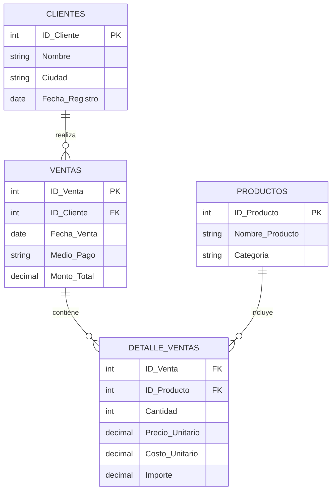

# 👋 Hola, somos Proyecto Aurelion

**Un sistema inteligente de análisis de ventas.**

---

## 🛠️ Tecnologías Utilizadas

- **Python** - Lenguaje principal
- **Pandas** - Manipulación de datos
- **NumPy** - Cálculos numéricos
- **Openpyxl** - Lectura de archivos Excel

---

## 🔍 Análisis del Problema Estratégico y la Solución

### El Desafío: Visión de Rentabilidad Descentralizada

El **Proyecto Aurelion** aborda el desafío central que enfrentan las cadenas de mini súper con presencia en **múltiples ciudades**: la **falta de una visión unificada y analítica de la rentabilidad** que permita optimizar la operación y la experiencia del cliente en cada ubicación. Actualmente, la empresa genera un gran volumen de datos de ventas, pero carece de un sistema automatizado para convertir estos datos en **información estratégica y accionable**. Esta **ceguera analítica** impide:

1. **Optimizar la Rentabilidad Geográfica:** No se sabe con certeza qué ciudades, clientes o categorías de productos están impulsando realmente las ganancias.
2. **Personalizar la Atención y Fidelización:** Es imposible identificar y recompensar a los **clientes más valiosos**, ni entender su comportamiento de compra a lo largo del tiempo.
3. **Mejorar la Eficiencia del Inventario:** La falta de un análisis sobre los productos menos vendidos o la estacionalidad provoca exceso de *stock* en ubicaciones equivocadas.

### Solución: Un Sistema de Inteligencia de Negocio

El sistema centraliza, calcula y analiza las métricas clave de negocio. Su objetivo es transformar los datos de ventas en conocimiento accionable para mejorar la rentabilidad general de la cadena de mini súper y optimizar los esfuerzos en áreas críticas como la atención al cliente, logística e inventario.

---

## ❓ Preguntas Críticas Resueltas por el Sistema

### 📊 Enfoque en Rentabilidad y Clientes (Ganancia)

- **Análisis Pareto (P1):** ¿Quiénes son los clientes que generan el 80% de los ingresos?
- **Comportamiento de Compra (P2, P3):** ¿Cuál es el promedio, mínimo y máximo de compra de nuestros clientes y qué tan frecuentes son sus pedidos?
- **Comportamiento del cliente (P4):** ¿Cuál es el cliente que más compra?
- **Activación y Lealtad (P13):** ¿Cuál es el comportamiento de compra de los clientes en diferentes períodos después de registrarse (30 días, 90 días, etc.)?
- **Media de producto (14):** ¿Cuál es la media de productos por compra y el importe total promedio?

### 📦 Enfoque en Inventario y Producto

- **Ingreso por Categoría (P5):** ¿Cuál es la categoría de productos que genera la mayor cantidad de ventas e ingresos?
- **Optimización de Stock (P6):** ¿Cuáles son los **10 productos menos vendidos** que podrían ser retirados o reemplazados?
- **Fidelización Inicial (P7):** ¿Cuáles son los productos más frecuentemente consumidos en el **primer pedido**?

### 🌍 Enfoque Geográfico y Operativo (Ciudades)

- **Rendimiento Regional (P8):** ¿Cómo se distribuyen los ingresos entre las ciudades y cuál genera más rentabilidad?
- **Rendimiento Regional (P9):** ¿Cuál es el comportamiento de compra de los clientes por períodos después de registrarse?
- **Medio de Pago por Ciudad (P10):** ¿Cuál es el porcentaje de ventas por medio de pago y varía este porcentaje según la ciudad?
- **Medio de Pago por Ciudad (P11):** ¿Cuál es el promedio de ventas por Medio de pago? ¿Cuál es el mes o trimestre con más ingresos?
- **Tendencia Temporal (P12):** ¿Cuál es el mes o trimestre con más ingresos a nivel general y por ciudad?

---

## 📂 Estructura y Composición de la Base de Datos

El sistema de análisis de ventas se basa en un conjunto de **cuatro tablas relacionales** que capturan la información de transacciones y entidades de negocio. El diseño original es un esquema transaccional, lo que requiere un proceso de **ETL (Extracción, Transformación y Carga)** para unificar la información y responder a las preguntas estratégicas.

---

### 1. Composición y Estructura Detallada de las Tablas

| Tabla (Archivo) | Clave Primaria (PK) | Claves Foráneas (FK) | Columnas Clave y Tipo de Dato | Registros (Estimado) |
|:----------------|:--------------------|:---------------------|:------------------------------|:---------------------|
| **Clientes** | `id_cliente` | N/A | `nombre_cliente`, `ciudad`, `fecha_alta` | ~100 |
| **Productos** | `id_producto` | N/A | `nombre_producto`, `categoria`, `precio_unitario` | ~100 |
| **Ventas** | `id_venta` | `id_cliente` | `fecha`, `medio_pago` | ~120 |
| **Detalle_ventas** | N/A (Compuesta) | `id_venta`, `id_producto` | `cantidad`, `precio_unitario`, `importe` | ~300+ |

#### **Esquema Relacional**



---

### 2. Explicación del Esquema Relacional (Joins)

El modelo utiliza claves para conectar lógicamente las transacciones con sus atributos. La tabla **`Detalle_ventas`** es el corazón del análisis y se conecta a las demás dimensiones:

- 👉 **Venta a Cliente:** `Ventas.id_cliente` enlaza con `Clientes.id_cliente`.
- 👉 **Detalle a Producto:** `Detalle_ventas.id_producto` enlaza con `Productos.id_producto`.
- 👉 **Detalle a Venta:** `Detalle_ventas.id_venta` enlaza con `Ventas.id_venta`.

---

### 3. 🚧 Reflexiones sobre la Base de Datos y Desafíos

#### A. Desafíos (Justificación del ETL)

La estructura transaccional requiere la **Transformación de Datos** (ETL) debido a:

- **Rentabilidad Inexistente:** La métrica de **`Ganancia Bruta`** debe ser **calculada** y no existe en los archivos de origen.
- **Venta Fragmentada:** El **`Monto Total de la Venta`** debe ser calculado sumando ítems de la tabla `Detalle_ventas`.
- **Integración:** Es necesaria la **unión total** de las 4 tablas en un **DataFrame Maestro** para el análisis eficiente.

#### B. Redundancias Observadas

Se identifican campos redundantes comunes en sistemas transaccionales que son gestionados en el ETL:

- La tabla `Ventas` repite atributos de cliente (`nombre_cliente`, `email`).
- La tabla `Detalle_ventas` repite atributos de producto (`nombre_producto`, `precio_unitario`).

---

## � Pseudocódigo del Sistema

### Flujo General del Programa

```
INICIO PROGRAMA

    FUNCIÓN mostrar_titulo()
        IMPRIMIR encabezado del proyecto
        IMPRIMIR información del autor
        ESPERAR 1 segundo
    FIN FUNCIÓN

    FUNCIÓN mostrar_analisis_problema()
        IMPRIMIR título de la sección
        IMPRIMIR contexto empresarial
        IMPRIMIR descripción completa del proyecto
        IMPRIMIR objetivos específicos
        PARA cada objetivo EN lista_objetivos:
            IMPRIMIR objetivo
            ESPERAR 0.5 segundos
        FIN PARA
    FIN FUNCIÓN

    FUNCIÓN mostrar_arquitectura_datos()
        IMPRIMIR título de la sección
        IMPRIMIR origen de los datos
        CREAR diccionario de tablas con sus campos
        PARA cada tabla EN diccionario_tablas:
            IMPRIMIR nombre de tabla y sus campos
            ESPERAR 0.5 segundos
        FIN PARA
    FIN FUNCIÓN

    FUNCIÓN mostrar_preguntas_estrategicas()
        IMPRIMIR título de la sección
        CREAR diccionario de categorías con preguntas
        PARA cada categoría EN diccionario_preguntas:
            IMPRIMIR nombre de categoría
            PARA cada pregunta EN lista_preguntas:
                IMPRIMIR pregunta numerada
                ESPERAR 0.3 segundos
            FIN PARA
        FIN PARA
    FIN FUNCIÓN

    FUNCIÓN mostrar_stack_tecnologico()
        IMPRIMIR título de la sección
        CREAR diccionario de tecnologías con sus propósitos
        PARA cada tecnología EN diccionario_stack:
            IMPRIMIR tecnología y su propósito
            ESPERAR 0.5 segundos
        FIN PARA
    FIN FUNCIÓN

    FUNCIÓN mostrar_solucion()
        IMPRIMIR título de la sección
        IMPRIMIR descripción de la solución
        ESPERAR 1 segundo
    FIN FUNCIÓN

    FUNCIÓN main()
        LLAMAR mostrar_titulo()
        
        CREAR diccionario de opciones del menú
        
        MIENTRAS verdadero:
            IMPRIMIR menú de opciones
            PARA cada opción EN diccionario_opciones:
                IMPRIMIR número y descripción de opción
            FIN PARA
            
            LEER eleccion_usuario
            
            SI eleccion_usuario == "7":
                IMPRIMIR mensaje de despedida
                SALIR del bucle
            
            SINO SI eleccion_usuario == "6":
                LLAMAR mostrar_analisis_problema()
                LLAMAR mostrar_arquitectura_datos()
                LLAMAR mostrar_preguntas_estrategicas()
                LLAMAR mostrar_stack_tecnologico()
                LLAMAR mostrar_solucion()
                IMPRIMIR mensaje de fin
            
            SINO SI eleccion_usuario está EN opciones_válidas:
                OBTENER función correspondiente
                LLAMAR función()
            
            SINO:
                IMPRIMIR mensaje de error
            FIN SI
            
            ESPERAR tecla Enter del usuario
        FIN MIENTRAS
    FIN FUNCIÓN

    EJECUTAR main()

FIN PROGRAMA
```

---

## �📝 Autor

**Sofia Suppia**  
Octubre 2025  
Fundamentos de Inteligencia Artificial
