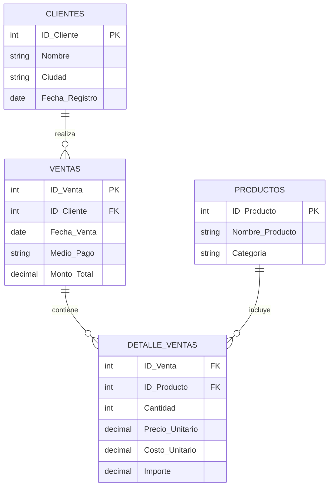

# 👋 Hola, somos Proyecto Aurelion

**Un sistema inteligente de análisis de ventas.**

---

## 🛠️ Tecnologías Utilizadas

- **Python** - Lenguaje principal
- **Pandas** - Manipulación de datos
- **NumPy** - Cálculos numéricos
- **Openpyxl** - Lectura de archivos Excel

---

## 🔍 Análisis del Problema Estratégico y la Solución

### El Desafío: Visión de Rentabilidad Descentralizada

El **Proyecto Aurelion** aborda el desafío central que enfrentan las cadenas de mini súper con presencia en **múltiples ciudades**: la **falta de una visión unificada y analítica de la rentabilidad** que permita optimizar la operación y la experiencia del cliente en cada ubicación. Actualmente, la empresa genera un gran volumen de datos de ventas, pero carece de un sistema automatizado para convertir estos datos en **información estratégica y accionable**. Esta **ceguera analítica** impide:

1. **Optimizar la Rentabilidad Geográfica:** No se sabe con certeza qué ciudades, clientes o categorías de productos están impulsando realmente las ganancias.
2. **Personalizar la Atención y Fidelización:** Es imposible identificar y recompensar a los **clientes más valiosos**, ni entender su comportamiento de compra a lo largo del tiempo.
3. **Mejorar la Eficiencia del Inventario:** La falta de un análisis sobre los productos menos vendidos o la estacionalidad provoca exceso de *stock* en ubicaciones equivocadas.

### Solución: Un Sistema de Inteligencia de Negocio

El sistema centraliza, calcula y analiza las métricas clave de negocio. Su objetivo es transformar los datos de ventas en conocimiento accionable para mejorar la rentabilidad general de la cadena de mini súper y optimizar los esfuerzos en áreas críticas como la atención al cliente, logística e inventario.

---

## ❓ Preguntas Críticas Resueltas por el Sistema

### 📊 Enfoque en Rentabilidad y Clientes (Ganancia)

- **Análisis Pareto (P1):** ¿Quiénes son los clientes que generan el 80% de los ingresos?
- **Comportamiento de Compra (P2, P3):** ¿Cuál es el promedio, mínimo y máximo de compra de nuestros clientes y qué tan frecuentes son sus pedidos?
- **Comportamiento del cliente (P4):** ¿Cuál es el cliente que más compra?
- **Activación y Lealtad (P13):** ¿Cuál es el comportamiento de compra de los clientes en diferentes períodos después de registrarse (30 días, 90 días, etc.)?
- **Media de producto (14):** ¿Cuál es la media de productos por compra y el importe total promedio?

### 📦 Enfoque en Inventario y Producto

- **Ingreso por Categoría (P5):** ¿Cuál es la categoría de productos que genera la mayor cantidad de ventas e ingresos?
- **Optimización de Stock (P6):** ¿Cuáles son los **10 productos menos vendidos** que podrían ser retirados o reemplazados?
- **Fidelización Inicial (P7):** ¿Cuáles son los productos más frecuentemente consumidos en el **primer pedido**?

### 🌍 Enfoque Geográfico y Operativo (Ciudades)

- **Rendimiento Regional (P8):** ¿Cómo se distribuyen los ingresos entre las ciudades y cuál genera más rentabilidad?
- **Rendimiento Regional (P9):** ¿Cuál es el comportamiento de compra de los clientes por períodos después de registrarse?
- **Medio de Pago por Ciudad (P10):** ¿Cuál es el porcentaje de ventas por medio de pago y varía este porcentaje según la ciudad?
- **Medio de Pago por Ciudad (P11):** ¿Cuál es el promedio de ventas por Medio de pago? ¿Cuál es el mes o trimestre con más ingresos?
- **Tendencia Temporal (P12):** ¿Cuál es el mes o trimestre con más ingresos a nivel general y por ciudad?

---

## 📂 Estructura y Composición de la Base de Datos

El sistema de análisis de ventas se basa en un conjunto de **cuatro tablas relacionales** que capturan la información de transacciones y entidades de negocio. El diseño original es un esquema transaccional, lo que requiere un proceso de **ETL (Extracción, Transformación y Carga)** para unificar la información y responder a las preguntas estratégicas.

---

### 1. Composición y Estructura Detallada de las Tablas

| Tabla (Archivo) | Clave Primaria (PK) | Claves Foráneas (FK) | Columnas Clave y Tipo de Dato | Registros (Estimado) |
|:----------------|:--------------------|:---------------------|:------------------------------|:---------------------|
| **Clientes** | `id_cliente` | N/A | `nombre_cliente`, `ciudad`, `fecha_alta` | ~100 |
| **Productos** | `id_producto` | N/A | `nombre_producto`, `categoria`, `precio_unitario` | ~100 |
| **Ventas** | `id_venta` | `id_cliente` | `fecha`, `medio_pago` | ~120 |
| **Detalle_ventas** | N/A (Compuesta) | `id_venta`, `id_producto` | `cantidad`, `precio_unitario`, `importe` | ~300+ |

#### **Esquema Relacional**



---

### 2. Explicación del Esquema Relacional (Joins)

El modelo utiliza claves para conectar lógicamente las transacciones con sus atributos. La tabla **`Detalle_ventas`** es el corazón del análisis y se conecta a las demás dimensiones:

- 👉 **Venta a Cliente:** `Ventas.id_cliente` enlaza con `Clientes.id_cliente`.
- 👉 **Detalle a Producto:** `Detalle_ventas.id_producto` enlaza con `Productos.id_producto`.
- 👉 **Detalle a Venta:** `Detalle_ventas.id_venta` enlaza con `Ventas.id_venta`.

---

### 3. 🚧 Reflexiones sobre la Base de Datos y Desafíos

#### A. Desafíos (Justificación del ETL)

La estructura transaccional requiere la **Transformación de Datos** (ETL) debido a:

- **Rentabilidad Inexistente:** La métrica de **`Ganancia Bruta`** debe ser **calculada** y no existe en los archivos de origen.
- **Venta Fragmentada:** El **`Monto Total de la Venta`** debe ser calculado sumando ítems de la tabla `Detalle_ventas`.
- **Integración:** Es necesaria la **unión total** de las 4 tablas en un **DataFrame Maestro** para el análisis eficiente.

#### B. Redundancias Observadas

Se identifican campos redundantes comunes en sistemas transaccionales que son gestionados en el ETL:

- La tabla `Ventas` repite atributos de cliente (`nombre_cliente`, `email`).
- La tabla `Detalle_ventas` repite atributos de producto (`nombre_producto`, `precio_unitario`).

---

## 📊 Análisis Estadístico Descriptivo

El sistema incorpora un **módulo completo de análisis estadístico descriptivo** que permite transformar los datos de ventas en información cuantitativa para la toma de decisiones. Este análisis cumple con 6 requisitos fundamentales de estadística aplicada al negocio.

---

### 1. 📈 Estadísticas Descriptivas Básicas

**Objetivo:** Calcular medidas de tendencia central y dispersión para las variables clave del negocio.

**Variables Analizadas:**
- `importe` - Valor total de cada venta
- `cantidad` - Número de productos por transacción
- `precio_unitario` - Precio promedio por producto
- `dias_desde_alta` - Antigüedad del cliente en días

**Métricas Calculadas:**

| Categoría | Medidas |
|:----------|:--------|
| **Tendencia Central** | Media, Mediana, Moda |
| **Dispersión** | Desviación Estándar, Mínimo, Máximo, Rango |
| **Cuartiles** | Q1 (25%), Q2 (50%), Q3 (75%), IQR (Rango Intercuartílico) |

**Interpretación Práctica:**
- La **media** indica el valor promedio de ventas
- La **mediana** muestra el punto medio resistente a valores extremos
- El **IQR** permite identificar la dispersión del 50% central de los datos

---

### 2. 🔍 Identificación del Tipo de Distribución

**Objetivo:** Determinar si los datos siguen una distribución normal o sesgada para aplicar técnicas estadísticas apropiadas.

**Métodos Utilizados:**
- **Comparación Media vs Mediana:** Diferencia porcentual entre ambas medidas
- **Asimetría (Skewness):** Mide la dirección y grado del sesgo
- **Curtosis (Kurtosis):** Evalúa el peso de las colas de la distribución

**Tipos de Distribución Identificados:**

| Tipo | Característica | Criterio |
|:-----|:---------------|:---------|
| **Normal (Simétrica)** | Datos balanceados alrededor de la media | \|Media - Mediana\| / Media < 5% |
| **Sesgada Positiva** | Cola derecha, valores altos extremos | Media > Mediana × 1.05 |
| **Sesgada Negativa** | Cola izquierda, valores bajos extremos | Media < Mediana × 0.95 |

**Importancia para el Negocio:**
- **Distribución Normal:** Permite usar promedios con confianza
- **Sesgo Positivo en Importe:** Indica presencia de clientes de alto valor (oportunidad VIP)
- **Sesgo en Cantidad:** Sugiere patrones de compra al por mayor vs minorista

---

### 3. 🔗 Análisis de Correlaciones

**Objetivo:** Identificar relaciones lineales entre variables cuantitativas para entender dependencias del negocio.

**Método:** Coeficiente de Correlación de Pearson (r)

**Variables Analizadas:**
- Correlación entre `cantidad` e `importe`
- Correlación entre `precio_unitario` e `importe`
- Correlación entre `dias_desde_alta` y comportamiento de compra

**Interpretación de Correlaciones:**

| Rango de r | Clasificación | Interpretación |
|:-----------|:--------------|:---------------|
| 0.7 < \|r\| ≤ 1.0 | **MUY FUERTE** | Relación lineal muy marcada |
| 0.5 < \|r\| ≤ 0.7 | **FUERTE** | Relación lineal considerable |
| 0.3 < \|r\| ≤ 0.5 | **MODERADA** | Relación lineal moderada |
| \|r\| ≤ 0.3 | **DÉBIL** | Poca o nula relación lineal |

**Dirección:**
- **r > 0:** Correlación POSITIVA (ambas variables aumentan juntas)
- **r < 0:** Correlación NEGATIVA (cuando una sube, la otra baja)

**Ejemplo de Hallazgo:**
> Si `cantidad` ↔ `importe` tiene r = 0.68 (Fuerte Positiva):  
> "A mayor cantidad de productos comprados, mayor es el importe total de la venta"

**⚠️ Nota Importante:** Correlación NO implica causalidad

---

### 4. 🎯 Detección de Outliers (Valores Extremos)

**Objetivo:** Identificar transacciones atípicas que podrían representar errores de datos u oportunidades de negocio.

**Método:** Rango Intercuartílico (IQR Method)

**Fórmula de Detección:**
```
Límite Inferior = Q1 - 1.5 × IQR
Límite Superior = Q3 + 1.5 × IQR

Outlier si: Valor < Límite Inferior O Valor > Límite Superior
```

**Variables Monitoreadas:**
- `importe` - Ventas excepcionalmente altas o bajas
- `cantidad` - Compras inusualmente grandes
- `precio_unitario` - Productos con precios atípicos
- `dias_desde_alta` - Clientes muy nuevos o muy antiguos

**Interpretación de Resultados:**

| % Outliers | Evaluación | Acción Recomendada |
|:-----------|:-----------|:-------------------|
| < 5% | ✅ Normal | Analizar individualmente, pueden ser casos especiales |
| 5% - 10% | ⚠️ Moderado | Revisar procesos de captura de datos |
| > 10% | 🚨 Alto | Investigar calidad de datos o cambios en el negocio |

**Ejemplos de Outliers en Negocio:**
- **Importe alto:** Compras corporativas o al por mayor → Oportunidad B2B
- **Cantidad alta:** Revendedores → Programa de mayoristas
- **Precio atípico:** Errores de carga o productos premium

---

### 5. 📊 Gráficos Representativos

**Objetivo:** Visualizar patrones, tendencias y distribuciones para comunicar hallazgos efectivamente.

**Gráficos Generados (6 tipos):**

#### 5.1. 📈 **Evolución Temporal de Ingresos Mensuales**
- **Tipo:** Gráfico de líneas con marcadores
- **Responde a:** P12 - Tendencia temporal de ventas
- **Hallazgos:** Identifica estacionalidad, meses pico y meses bajos
- **Decisiones:** Planificación de inventario y campañas promocionales

#### 5.2. 📊 **Ingresos por Categoría de Producto**
- **Tipo:** Gráfico de barras verticales
- **Responde a:** P5 - Categorías más rentables
- **Hallazgos:** Distribución de ingresos por categoría
- **Decisiones:** Optimización de mix de productos y espacio en góndola

#### 5.3. 🔵 **Relación Cantidad vs Importe (Dispersión)**
- **Tipo:** Scatter plot con línea de tendencia
- **Responde a:** P14 - Correlación cantidad-importe
- **Hallazgos:** Validación de relación lineal entre variables
- **Decisiones:** Estrategias de bundling y descuentos por volumen

#### 5.4. 📦 **Distribución del Importe (Boxplot)**
- **Tipo:** Diagrama de caja y bigotes
- **Responde a:** P2 - Estadísticas de compra
- **Hallazgos:** Mediana, cuartiles y outliers visualizados
- **Decisiones:** Segmentación de clientes por ticket de compra

#### 5.5. 📊 **Distribución de Antigüedad de Clientes (Histograma)**
- **Tipo:** Histograma con línea de media
- **Responde a:** P13 - Comportamiento según antigüedad
- **Hallazgos:** Patrón de distribución de días desde el alta
- **Decisiones:** Programas de fidelización según antigüedad

#### 5.6. 🔥 **Matriz de Correlaciones (Heatmap)**
- **Tipo:** Mapa de calor con 8 variables
- **Variables:** id_producto, cantidad, precio_unitario, importe, anio, mes, trimestre, dias_desde_alta
- **Responde a:** Análisis multivariable general
- **Hallazgos:** Relaciones entre todas las variables numéricas
- **Decisiones:** Identificación de drivers de rentabilidad

**Características Técnicas:**
- Resolución: 300 DPI (calidad de publicación)
- Formato: PNG
- Estilo: Profesional con paleta de colores consistente
- Ubicación: Disponibles en `Graficos.ipynb` y generados por `analisis_estadistico.py`

---

### 6. 💡 Interpretación de Resultados Orientada al Negocio

**Objetivo:** Transformar hallazgos estadísticos en recomendaciones estratégicas accionables.

#### 6.1. 📊 **Análisis de Ingresos**

**Métricas Clave:**
- Ticket promedio vs ticket mediano
- Distribución de valores de compra
- Detección de compras de alto valor

**Interpretaciones:**
```
SI Media >> Mediana (>20% diferencia):
    → Hay clientes de alto valor que elevan el promedio
    → ACCIÓN: Crear programa VIP para clientes premium
    → ACCIÓN: Estrategia de upselling para clientes promedio

SI Media ≈ Mediana:
    → Distribución equilibrada de compras
    → ACCIÓN: Estrategias de crecimiento uniforme
```

#### 6.2. 📦 **Categorías Más Rentables**

**Análisis:**
- Top 3 categorías por ingresos
- Porcentaje de contribución al total
- Concentración de la rentabilidad

**Ejemplo de Recomendación:**
> **Hallazgo:** "Alimentos genera 83.5% de los ingresos totales"  
> **Acción 1:** Aumentar variedad y stock en categoría Alimentos  
> **Acción 2:** Analizar por qué otras categorías tienen bajo rendimiento  
> **Acción 3:** Considerar eliminar categorías no rentables

#### 6.3. 📅 **Comportamiento Temporal**

**Métricas:**
- Mejor mes vs peor mes
- Variación porcentual entre extremos
- Identificación de estacionalidad

**Ejemplo de Recomendación:**
> **Hallazgo:** "Mayo: $561,832 | Abril: $251,524 (123% variación)"  
> **Acción 1:** Aumentar inventario en abril-mayo anticipando pico  
> **Acción 2:** Promociones agresivas en marzo para anticipar compras  
> **Acción 3:** Investigar causas de baja en abril (feriados, competencia)

#### 6.4. 👥 **Comportamiento del Cliente**

**Análisis:**
- Antigüedad promedio de clientes
- Ticket promedio: clientes nuevos (≤90 días) vs antiguos (>90 días)
- Patrón de fidelización

**Interpretaciones:**
```
SI Ticket_Antiguos > Ticket_Nuevos:
    → Los clientes se vuelven más valiosos con el tiempo
    → ACCIÓN: Programa de fidelización para retención
    → ACCIÓN: Beneficios progresivos por antigüedad

SI Ticket_Nuevos > Ticket_Antiguos:
    → ⚠️ ALERTA: Los clientes reducen compras con el tiempo
    → ACCIÓN: Investigar causas de deserción
    → ACCIÓN: Programa de reactivación
```

#### 6.5. 🎯 **Valores Extremos y Oportunidades**

**Análisis de Outliers:**
- Identificación de compras atípicas
- Porcentaje de outliers detectados
- Caracterización de casos extremos

**Ejemplo de Recomendación:**
> **Hallazgo:** "7 compras atípicas detectadas (2% del total)"  
> **Interpretación:** Posibles compras corporativas o revendedores  
> **Acción 1:** Contactar estos clientes con ofertas B2B  
> **Acción 2:** Crear programa de mayoristas  
> **Acción 3:** Diseñar paquetes especiales para volumen

#### 6.6. 📋 **Resumen Ejecutivo**

El sistema genera automáticamente un resumen ejecutivo con:

✅ **Métricas Principales:**
- Ticket promedio del negocio
- Categoría líder y su contribución porcentual
- Tendencia de ventas (creciente/variable/decreciente)
- Perfil de cliente más valioso

🎯 **Prioridades Estratégicas:**
1. Optimizar inventario en categorías rentables
2. Implementar programa de fidelización
3. Planificar campañas para meses de baja venta
4. Desarrollar segmento B2B para ventas al por mayor
5. Analizar causas de outliers para replicar éxitos

---

### 🔧 Implementación Técnica del Análisis Estadístico

**Archivos del Sistema:**

| Archivo | Propósito | Características |
|:--------|:----------|:----------------|
| `analisis_estadistico.py` | Script independiente de análisis | Genera 6 gráficos PNG + análisis completo en consola |
| `entrega2.py` | Sistema integrado con menú | Opciones 7-13 para análisis modular o completo |
| `Graficos.ipynb` | Notebook interactivo | Exploración visual con celdas ejecutables |

**Librerías Utilizadas:**

```python
import pandas as pd      # Manipulación de datos
from scipy import stats  # Skewness, Kurtosis
import os               # Gestión de rutas absolutas
```

**Flujo de Ejecución:**

```
1. Carga de Datos
   └─> Lectura de Tabla_Maestra_limpia.csv (343 registros)

2. Estadísticas Descriptivas
   └─> Cálculo de 11 métricas por variable (4 variables)

3. Análisis de Distribución
   └─> Clasificación: Normal/Sesgada Positiva/Negativa

4. Matriz de Correlaciones
   └─> Pearson entre 4 variables clave

5. Detección de Outliers
   └─> Método IQR aplicado a 4 variables

6. Generación de Gráficos
   └─> 6 visualizaciones en formato PNG (300 DPI)

7. Interpretación de Negocio
   └─> Recomendaciones estratégicas basadas en hallazgos
```

**Ejecución:**
```bash
# Script independiente
py analisis_estadistico.py

# Sistema integrado
py entrega2.py
# Seleccionar opciones 7-12 (análisis modular)
# O seleccionar opción 13 (análisis completo)

# Notebook interactivo
# Abrir Graficos.ipynb en Jupyter/VS Code
```

---

## �📝 Pseudocódigo del Sistema

### Flujo General del Programa

```
INICIO PROGRAMA

    FUNCIÓN mostrar_titulo()
        IMPRIMIR encabezado del proyecto
        IMPRIMIR información del autor
        ESPERAR 1 segundo
    FIN FUNCIÓN

    FUNCIÓN mostrar_analisis_problema()
        IMPRIMIR título de la sección
        IMPRIMIR contexto empresarial
        IMPRIMIR descripción completa del proyecto
        IMPRIMIR objetivos específicos
        PARA cada objetivo EN lista_objetivos:
            IMPRIMIR objetivo
            ESPERAR 0.5 segundos
        FIN PARA
    FIN FUNCIÓN

    FUNCIÓN mostrar_arquitectura_datos()
        IMPRIMIR título de la sección
        IMPRIMIR origen de los datos
        CREAR diccionario de tablas con sus campos
        PARA cada tabla EN diccionario_tablas:
            IMPRIMIR nombre de tabla y sus campos
            ESPERAR 0.5 segundos
        FIN PARA
    FIN FUNCIÓN

    FUNCIÓN mostrar_preguntas_estrategicas()
        IMPRIMIR título de la sección
        CREAR diccionario de categorías con preguntas
        PARA cada categoría EN diccionario_preguntas:
            IMPRIMIR nombre de categoría
            PARA cada pregunta EN lista_preguntas:
                IMPRIMIR pregunta numerada
                ESPERAR 0.3 segundos
            FIN PARA
        FIN PARA
    FIN FUNCIÓN

    FUNCIÓN mostrar_stack_tecnologico()
        IMPRIMIR título de la sección
        CREAR diccionario de tecnologías con sus propósitos
        PARA cada tecnología EN diccionario_stack:
            IMPRIMIR tecnología y su propósito
            ESPERAR 0.5 segundos
        FIN PARA
    FIN FUNCIÓN

    FUNCIÓN mostrar_solucion()
        IMPRIMIR título de la sección
        IMPRIMIR descripción de la solución
        ESPERAR 1 segundo
    FIN FUNCIÓN

    FUNCIÓN main()
        LLAMAR mostrar_titulo()
        
        CREAR diccionario de opciones del menú
        
        MIENTRAS verdadero:
            IMPRIMIR menú de opciones
            PARA cada opción EN diccionario_opciones:
                IMPRIMIR número y descripción de opción
            FIN PARA
            
            LEER eleccion_usuario
            
            SI eleccion_usuario == "7":
                IMPRIMIR mensaje de despedida
                SALIR del bucle
            
            SINO SI eleccion_usuario == "6":
                LLAMAR mostrar_analisis_problema()
                LLAMAR mostrar_arquitectura_datos()
                LLAMAR mostrar_preguntas_estrategicas()
                LLAMAR mostrar_stack_tecnologico()
                LLAMAR mostrar_solucion()
                IMPRIMIR mensaje de fin
            
            SINO SI eleccion_usuario está EN opciones_válidas:
                OBTENER función correspondiente
                LLAMAR función()
            
            SINO:
                IMPRIMIR mensaje de error
            FIN SI
            
            ESPERAR tecla Enter del usuario
        FIN MIENTRAS
    FIN FUNCIÓN

    EJECUTAR main()

FIN PROGRAMA
```

---

## �📝 Autor

**Sofia Suppia**  
Octubre 2025  
Fundamentos de Inteligencia Artificial
