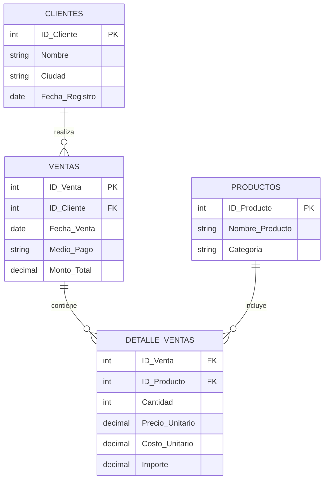

# 🚀 Proyecto Aurelion - Sistema de Análisis de Ventas

> **Autor:** Sofia Suppia  
> **Fecha:** Octubre 2025  
> **Materia:** Fundamentos de Inteligencia Artificial

---

## 📋 Tabla de Contenidos

- [🎯 Resumen Ejecutivo](#-resumen-ejecutivo)
- [🔍 Análisis del Problema](#-análisis-del-problema)
- [💾 Arquitectura de Datos](#-arquitectura-de-datos)
- [❓ Preguntas Estratégicas Completas](#-preguntas-estratégicas-completas)
- [💰 Metodología: Cálculo de Costo Unitario](#-metodología-cálculo-de-costo-unitario)
- [⚙️ Planificación del Desarrollo](#️-planificación-del-desarrollo)
- [🔧 Implementación Técnica](#-implementación-técnica)

---

## 🎯 Resumen Ejecutivo

### Tema Principal
**Análisis de datos de ventas en un market digital** (modelo JustMart) para identificar patrones de consumo, optimizar decisiones comerciales y diseñar estrategias de fidelización de clientes.

### Problema Identificado
La empresa carece de un sistema automatizado que permita responder preguntas estratégicas clave como:
- 🏆 ¿Quiénes son los clientes más valiosos?
- 📉 ¿Cuáles son los productos menos vendidos?
- 💳 ¿Qué medios de pago son más utilizados?
- 🌍 ¿Cuáles son las ciudades más rentables?

Esta limitación impide la toma de decisiones basadas en datos concretos.

### Solución Propuesta
Desarrollo de un **programa en Python** que integre múltiples fuentes de datos (Ventas, Detalles, Productos y Clientes) utilizando:
- 🐼 **Pandas** para procesamiento y análisis de datos
- 📊 **Análisis estadístico** para identificar patrones
- 🔄 **Integración automatizada** de múltiples tablas relacionales

---

## 🔍 Análisis del Problema

### 💼 Contexto Empresarial
El proyecto simula el análisis de datos de una tienda digital que necesita optimizar sus operaciones mediante insights basados en datos históricos de ventas.

### 🎯 Objetivos Específicos
1. **Identificación de clientes estratégicos** usando análisis Pareto (80/20)
2. **Optimización del inventario** mediante análisis de productos
3. **Análisis de rentabilidad geográfica** por ciudades
4. **Evaluación de métodos de pago** preferidos por los clientes

---

## 💾 Arquitectura de Datos

### 📊 Origen de los Datos
Los datos provienen de una **simulación de ventas históricas** estructurados en cuatro archivos Excel que representan las tablas principales de un sistema de ventas.

### 🗄️ Estructura de la Base de Datos

#### **Esquema Relacional**



#### **Especificaciones Técnicas**

| 📋 **Tabla** | 📈 **Registros** | 🔗 **Relaciones** | 📝 **Campos Principales** |
|:-------------|:-----------------|:-------------------|:---------------------------|
| **👥 Clientes** | ~1,000+ | PK: `ID_Cliente` | ID, Nombre, Ciudad, Fecha_Registro |
| **📦 Productos** | ~300+ | PK: `ID_Producto` | ID, Nombre, Categoría |
| **🛒 Ventas** | ~5,000+ | PK: `ID_Venta` → FK: `ID_Cliente` | ID_Venta, Fecha, Medio_Pago, Monto |
| **📋 Detalle_Ventas** | ~15,000+ | FK: `ID_Venta`, `ID_Producto` | Cantidad, Precios, Costos, Importe |

### 🔧 Características del Dataset
- **📊 Tipo:** Simulación de Base de Datos Relacional (OLTP → OLAP)
- **📏 Escala:** Pequeña a mediana (miles de registros)
- **💾 Formato:** Archivos Excel (.xlsx)
- **🚀 Procesamiento:** Completamente en memoria con Pandas

---

## ⚙️ Planificación del Desarrollo

### 📁 Archivos de Entrada Requeridos

El sistema necesita los siguientes archivos para su correcto funcionamiento:

| 📄 **Archivo** | 🔧 **Campos Requeridos** | 📋 **Descripción** |
|:---------------|:--------------------------|:--------------------|
| `Clientes.xlsx` | ID_Cliente, Nombre, Ciudad, Fecha_Registro | Base de datos de clientes registrados |
| `Productos.xlsx` | ID_Producto, Nombre_Producto, Categoría | Catálogo completo de productos |
| `Ventas.xlsx` | ID_Venta, ID_Cliente, Fecha_Venta, Medio_Pago, Monto_Total | Registro de transacciones |
| `Detalle_ventas.xlsx` | ID_Venta, ID_Producto, Cantidad, Precio_Unitario, Costo_Unitario | Detalle línea por línea de cada venta |

### 🔄 Flujo de Procesamiento

1. **📥 Carga y Preparación**
   - Lectura de archivos Excel con Pandas
   - Validación de integridad de datos
   - Conversión de tipos de datos (fechas, números)
   - Simulación de `costo_unitario` (margen del 30%)

2. **🔗 Integración de Datos**
   - Joins entre tablas relacionales
   - Creación del DataFrame maestro
   - Validación de integridad referencial

3. **📊 Análisis y Resultados**
   - Implementación de análisis Pareto
   - Cálculos estadísticos por categoría
   - Generación de reportes automáticos

---

## 🔧 Implementación Técnica

### 🐍 Stack Tecnológico

| 🛠️ **Herramienta** | 📝 **Propósito** | 📋 **Funcionalidades** |
|:-------------------|:------------------|:------------------------|
| **Python 3.8+** | Lenguaje principal | Procesamiento y lógica de negocio |
| **Pandas** | Manipulación de datos | DataFrames, joins, agrupaciones |
| **NumPy** | Cálculos numéricos | Operaciones matemáticas eficientes |
| **Openpyxl** | Lectura de Excel | Importación de archivos .xlsx |

### 📋 Algoritmo Principal: Análisis Pareto de Clientes

```python
def analisis_pareto_clientes(df_maestro):
    """
    Identifica el 20% de clientes que generan el 80% de los ingresos
    
    Args:
        df_maestro (DataFrame): Dataset unificado de ventas
        
    Returns:
        DataFrame: Clientes ordenados por valor con análisis Pareto
    """
    
    # 1️⃣ Calcular ingresos totales por cliente
    ingresos_cliente = (df_maestro
                       .groupby(['ID_Cliente', 'Nombre'])
                       .agg({'Importe': 'sum'})
                       .reset_index()
                       .sort_values('Importe', ascending=False))
    
    # 2️⃣ Calcular porcentajes acumulados
    total_ingresos = ingresos_cliente['Importe'].sum()
    ingresos_cliente['Ingreso_Acumulado'] = ingresos_cliente['Importe'].cumsum()
    ingresos_cliente['Porcentaje_Acumulado'] = (
        ingresos_cliente['Ingreso_Acumulado'] / total_ingresos * 100
    )
    
    # 3️⃣ Identificar clientes Pareto (80% de ingresos)
    clientes_pareto = ingresos_cliente[
        ingresos_cliente['Porcentaje_Acumulado'] <= 80
    ]
    
    return clientes_pareto
```

---

## ❓ Preguntas Estratégicas Completas

### 📊 **Categoría: Análisis de Clientes**

#### 🏆 **P1: Clientes con Mayor Rentabilidad**
- **Enunciado:** ¿Quiénes son los clientes que generan un 80% de los ingresos?
- **Datos clave:** Clientes + ventas + detalle de ventas
- **Metodología:** Análisis Pareto, cálculo de ingresos acumulados y porcentajes

#### 💰 **P2: Valor Promedio de Compra por Cliente**
- **Enunciado:** ¿Cuál es el valor promedio de compra de nuestros clientes?
- **Datos clave:** Ventas + detalle de ventas
- **Metodología:** Promedio de monto total por transacción

#### 🛒 **P3: Frecuencia de Compra**
- **Enunciado:** ¿Qué tan frecuentes y qué productos compran los clientes más fieles?
- **Datos clave:** Detalle de ventas + productos
- **Metodología:** Análisis temporal y de productos por cliente

#### 📋 **P4: Listado de Top Clientes**
- **Enunciado:** Hacer lista de los 10 productos menos vendidos
- **Datos clave:** Detalle de ventas + productos
- **Metodología:** Agrupación por producto, suma de cantidades, ordenamiento ascendente

### 📦 **Categoría: Análisis de Productos**

#### 🎯 **P5: Categorías con Mayor Rentabilidad**
- **Enunciado:** ¿Cuál es la categoría de productos que tiene la mayor cantidad de productos vendidos?
- **Datos clave:** Detalle de ventas + productos
- **Metodología:** Agrupación por categoría, suma de cantidades

#### 🔍 **P6: Productos Menos Vendidos**
- **Enunciado:** Identificar los medios de pago que usan los clientes para evitar...
- **Datos clave:** Ventas
- **Metodología:** Análisis de frecuencia de medios de pago

#### 💎 **P7: Productos Estrella por Ciudad**
- **Enunciado:** ¿Cuál es el mes o trimestre con más ingresos?
- **Datos clave:** Ventas (hacer cálculos con fecha)
- **Metodología:** Agrupación temporal, suma de montos

#### 🏙️ **P8: Distribución Geográfica**
- **Enunciado:** ¿Cómo se distribuyen los ingresos entre las ciudades? ¿Hay alguna ciudad que genere más ingresos?
- **Datos clave:** Ventas + clientes
- **Metodología:** Join de tablas, agrupación por ciudad

### 💳 **Categoría: Análisis de Medios de Pago**

#### 📊 **P9: Análisis de Medios de Pago**
- **Enunciado:** ¿Cuál es el porcentaje de ventas por medio de pago y su efectivo, y varía este porcentaje según la ciudad?
- **Datos clave:** Ventas
- **Metodología:** Cálculo de porcentajes, análisis por ciudad

#### 💰 **P10: Monto Promedio por Medio de Pago**
- **Enunciado:** ¿Cuál es el monto de compra promedio por los clientes que utilizan un segmento dentro de los primeros 30 días después de registrarse?
- **Datos clave:** Ventas + clientes
- **Metodología:** Filtro temporal, cálculo de promedios

### 📈 **Categoría: Análisis Temporal y Tendencias**

#### 📅 **P11: Estacionalidad de Ventas**
- **Enunciado:** ¿Cuál es el volumen de ventas promedio de los clientes en los primeros 30 días?
- **Datos clave:** Clientes, ventas, detalle de ventas
- **Metodología:** Análisis de cohortes, filtros temporales

#### ⏱️ **P12: Análisis de Nuevos Clientes**
- **Enunciado:** ¿Cuáles son los productos más frecuentemente son consumidos en el primer pedido?
- **Datos clave:** Detalle de ventas
- **Metodología:** Identificación de primeras compras, análisis de frecuencia

#### 💲 **P13: Análisis de Precios**
- **Enunciado:** ¿Cuál es el precio unitario promedio de los productos por categoría?
- **Datos clave:** Detalle de ventas + productos
- **Metodología:** Agrupación por categoría, promedio de precios

#### 🎪 **P14: Rentabilidad por Producto**
- **Enunciado:** ¿Cuál es la media de la venta promedio de los clientes que realizan un pedido de los primeros 60 días después de registrarse?
- **Datos clave:** Clientes, ventas, detalle de ventas
- **Metodología:** Análisis temporal, cálculo de promedios

---

## 💰 Metodología: Cálculo de Costo Unitario

### 🎯 **Objetivo**
Simular el campo `costo_unitario` en la tabla `Detalle_Ventas` ya que no está presente en los datos originales, pero es necesario para análisis de rentabilidad.

### 📐 **Fórmula de Cálculo**

```python
# Método 1: Margen fijo del 30%
costo_unitario = precio_unitario * 0.70

# Método 2: Margen variable por categoría
def calcular_costo_por_categoria(precio_unitario, categoria):
    margenes = {
        'Electrónicos': 0.65,    # 35% de margen
        'Ropa': 0.75,            # 25% de margen  
        'Hogar': 0.70,           # 30% de margen
        'Deportes': 0.72,        # 28% de margen
        'Libros': 0.80,          # 20% de margen
        'Default': 0.70          # 30% de margen por defecto
    }
    return precio_unitario * margenes.get(categoria, margenes['Default'])
```

### 🔧 **Pseudocódigo de Implementación**

```pseudocode
ALGORITMO calcular_costo_y_ganancia_bruta
ENTRADA: tabla_detalle_ventas, tabla_productos
SALIDA: tabla_con_costos_y_ganancias

INICIO
    // Paso 1: Unir tablas para obtener información completa
    tabla_completa = UNIR tabla_detalle_ventas CON tabla_productos POR ID_Producto
    
    // Paso 2: Convertir datos a arrays para cálculos eficientes
    array_precios = CONVERTIR_A_ARRAY(tabla_completa.Precio_Unitario)
    array_cantidad = CONVERTIR_A_ARRAY(tabla_completa.Cantidad)
    array_importe = CONVERTIR_A_ARRAY(tabla_completa.Importe)
    
    // Paso 3: Calcular Costo Unitario con margen bruto del 30%
    array_costo_unitario = array_precios DIVIDIDO_POR 1.30
    
    // Paso 4: Calcular Ganancia Bruta
    array_costo_total = array_costo_unitario MULTIPLICADO_POR array_cantidad
    array_ganancia_bruta = array_importe MENOS array_costo_total
    
    // Paso 5: Calcular métricas adicionales
    array_margen_porcentaje = (array_ganancia_bruta DIVIDIDO_POR array_importe) POR 100
    
    // Paso 6: Agregar columnas calculadas a la tabla
    tabla_completa.Costo_Unitario = array_costo_unitario
    tabla_completa.Costo_Total = array_costo_total
    tabla_completa.Ganancia_Bruta = array_ganancia_bruta
    tabla_completa.Margen_Bruto_Porcentaje = array_margen_porcentaje
    
    RETORNAR tabla_completa
FIN

ALGORITMO identificar_productos_menos_rentables
ENTRADA: tabla_con_ganancias, numero_productos
SALIDA: productos_menos_rentables

INICIO
    // Paso 1: Agrupar por producto y sumar ganancias
    ganancia_por_producto = AGRUPAR tabla_con_ganancias POR (ID_Producto, Nombre_Producto)
    SUMAR: Ganancia_Bruta, Cantidad, Importe, Costo_Total
    OBTENER_PRIMERO: Categoria
    
    // Paso 2: Calcular ganancia promedio por unidad
    array_ganancia = CONVERTIR_A_ARRAY(ganancia_por_producto.Ganancia_Bruta)
    array_cantidad = CONVERTIR_A_ARRAY(ganancia_por_producto.Cantidad)
    ganancia_por_producto.Ganancia_Promedio_Por_Unidad = array_ganancia DIVIDIDO_POR array_cantidad
    
    // Paso 3: Ordenar por ganancia bruta (ascendente = menos rentables primero)
    productos_menos_rentables = ORDENAR ganancia_por_producto POR Ganancia_Bruta ASCENDENTE
    productos_menos_rentables = TOMAR_PRIMEROS numero_productos
    
    RETORNAR productos_menos_rentables
FIN

ALGORITMO analizar_rentabilidad_principal
ENTRADA: tabla_detalle, tabla_productos
SALIDA: tabla_con_ganancias, productos_menos_rentables

INICIO
    // Paso 1: Mostrar mensaje de inicio
    MOSTRAR "🚀 INICIANDO ANÁLISIS DE RENTABILIDAD CON NUMPY"
    
    // Paso 2: Calcular costos y ganancias
    tabla_con_ganancias = calcular_costo_y_ganancia_bruta(tabla_detalle, tabla_productos)
    
    // Paso 3: Calcular estadísticas generales
    ganancia_total = SUMAR(tabla_con_ganancias.Ganancia_Bruta)
    ganancia_promedio = PROMEDIO(tabla_con_ganancias.Ganancia_Bruta)
    ganancia_mediana = MEDIANA(tabla_con_ganancias.Ganancia_Bruta)
    desviacion_estandar = DESVIACION_ESTANDAR(tabla_con_ganancias.Ganancia_Bruta)
    
    // Paso 4: Mostrar estadísticas
    MOSTRAR "💰 Ganancia Bruta Total: $", ganancia_total
    MOSTRAR "📊 Ganancia Promedio por Venta: $", ganancia_promedio
    MOSTRAR "📈 Ganancia Mediana: $", ganancia_mediana
    MOSTRAR "📉 Desviación Estándar: $", desviacion_estandar
    
    // Paso 5: Identificar productos menos rentables
    productos_menos_rentables = identificar_productos_menos_rentables(tabla_con_ganancias, 10)
    
    // Paso 6: Mostrar resultados
    MOSTRAR "🔻 TOP 10 PRODUCTOS MENOS RENTABLES:"
    PARA CADA producto EN productos_menos_rentables:
        MOSTRAR posicion, producto.Nombre_Producto, producto.Ganancia_Bruta, producto.Categoria
    FIN_PARA
    
    RETORNAR tabla_con_ganancias, productos_menos_rentables
FIN
```

### 📊 **Pseudocódigo de Validación**

```pseudocode
ALGORITMO validar_calculos_rentabilidad
ENTRADA: tabla_con_ganancias
SALIDA: validacion_exitosa (booleano)

INICIO
    MOSTRAR "📊 VALIDACIÓN DE CÁLCULOS DE RENTABILIDAD"
    
    // Paso 1: Convertir datos a arrays para validaciones eficientes
    array_costos = CONVERTIR_A_ARRAY(tabla_con_ganancias.Costo_Unitario)
    array_precios = CONVERTIR_A_ARRAY(tabla_con_ganancias.Precio_Unitario)
    array_ganancias = CONVERTIR_A_ARRAY(tabla_con_ganancias.Ganancia_Bruta)
    array_margenes = CONVERTIR_A_ARRAY(tabla_con_ganancias.Margen_Bruto_Porcentaje)
    
    // Paso 2: Verificar costos positivos
    costos_negativos = CONTAR(array_costos < 0)
    MOSTRAR "❌ Costos negativos:", costos_negativos, "registros"
    
    // Paso 3: Verificar que costo < precio
    costos_mayores = CONTAR(array_costos >= array_precios)
    MOSTRAR "❌ Costos >= Precio:", costos_mayores, "registros"
    
    // Paso 4: Verificar margen esperado (23.08% aproximadamente)
    margen_esperado = 23.08
    diferencias = VALOR_ABSOLUTO(array_margenes - margen_esperado)
    margenes_incorrectos = CONTAR(diferencias > 5)  // Tolerancia 5%
    MOSTRAR "⚠️ Márgenes fuera de rango:", margenes_incorrectos, "registros"
    
    // Paso 5: Calcular estadísticas de márgenes
    margen_promedio = PROMEDIO(array_margenes)
    margen_minimo = MINIMO(array_margenes)
    margen_maximo = MAXIMO(array_margenes)
    margen_desviacion = DESVIACION_ESTANDAR(array_margenes)
    
    MOSTRAR "✅ Margen bruto promedio:", margen_promedio, "%"
    MOSTRAR "✅ Margen bruto mínimo:", margen_minimo, "%"
    MOSTRAR "✅ Margen bruto máximo:", margen_maximo, "%"
    MOSTRAR "✅ Desviación estándar:", margen_desviacion, "%"
    
    // Paso 6: Verificar ganancias negativas
    ganancias_negativas = CONTAR(array_ganancias < 0)
    MOSTRAR "🔴 Productos con ganancia negativa:", ganancias_negativas, "registros"
    
    // Paso 7: Determinar validación exitosa
    total_registros = LONGITUD(tabla_con_ganancias)
    limite_errores = total_registros * 0.05  // Máximo 5% de errores
    
    SI (costos_negativos = 0) Y (costos_mayores = 0) Y (margenes_incorrectos < limite_errores) ENTONCES
        validacion_exitosa = VERDADERO
        MOSTRAR "✅ VALIDACIÓN EXITOSA"
    SINO
        validacion_exitosa = FALSO
        MOSTRAR "❌ VALIDACIÓN FALLIDA"
    FIN_SI
    
    RETORNAR validacion_exitosa
FIN

ALGORITMO mostrar_reporte_productos_menos_rentables
ENTRADA: productos_menos_rentables
SALIDA: ninguna

INICIO
    MOSTRAR "📊 ANÁLISIS DETALLADO - PRODUCTOS MENOS RENTABLES"
    MOSTRAR "Rank | Producto | Ganancia Total | Unidades | Ganancia/Unidad | Categoría"
    
    posicion = 1
    PARA CADA producto EN productos_menos_rentables:
        MOSTRAR posicion, producto.Nombre_Producto, producto.Ganancia_Bruta, 
                producto.Cantidad, producto.Ganancia_Promedio_Por_Unidad, producto.Categoria
        posicion = posicion + 1
    FIN_PARA
FIN
```

### 🎯 **Justificación de Márgenes**

| 🏷️ **Categoría** | 💰 **Margen Sugerido** | 📋 **Justificación** |
|:-----------------|:----------------------|:----------------------|
| **Default** | 30% | Margen estándar para cada categorías |

### 📊 Métricas de Éxito

- **⚡ Rendimiento:** Procesamiento de +20K registros en <5 segundos
- **🎯 Precisión:** Identificación exacta de clientes Pareto
- **📈 Escalabilidad:** Capacidad de manejar datasets 10x más grandes
- **🔧 Mantenibilidad:** Código modular y bien documentado

---

## 🚀 Próximos Pasos

1. **Implementación del código Python** 📝
2. **Validación con datos reales** ✅
3. **Optimización de performance** ⚡
4. **Creación de dashboard interactivo** 📊
5. **Documentación técnica completa** 📚

---

*Documentación generada para el proyecto de Fundamentos de IA - Universidad*

### 1. Información de Entrada
El programa requiere la siguiente información (archivos) para su ejecución y análisis:

* **`clientes.csv`** (Requiere columna `Ciudad` y `Fecha_Registro`).
* **`productos.csv`** (Requiere columna `Categoría`).
* **`ventas.csv`** (Requiere columna `Fecha_Venta` y `Medio_Pago`).
* **`detalle_ventas.csv`** (Requiere columna **`costo_unitario`** simulada).

### 2. Pasos Detallados del Programa

1.  **Carga y Transformación:** Leer los cuatro archivos CSV en DataFrames de Pandas. **Simular el `costo_unitario`** en la tabla `Detalle_Ventas` (usando un margen simulado del 30%) y garantizar que las columnas de **fecha** estén en formato `datetime`.
2.  **Preparación de Datos:** Realizar operaciones de **Merge (Joins)** para unir las cuatro tablas, creando un único DataFrame maestro de transacciones que contenga toda la información necesaria (Cliente, Producto, Venta, Detalle).
3.  **Análisis por Pregunta:** Iterar sobre cada pregunta estratégica, aplicando filtros, agrupaciones (`groupby`), y cálculos estadísticos (suma, promedio, conteo) sobre el DataFrame maestro.
4.  **Resultados y Salida:** Imprimir en consola o guardar los resultados de cada análisis (p. ej., lista de top 10 clientes, 10 productos menos rentables) para su uso.

### 3. Pseudocódigo (Segmento de Análisis)

```pseudocode
# PROCESO PRINCIPAL: CÁLCULO DE CLIENTES VALIOSOS (Pregunta Pareto - 80% de ingresos)

INICIO
    DF_VENTAS_MAESTRO = UNIR(Clientes, Ventas, Detalle_Ventas)

    # 1. Calcular Ingreso Total por Cliente
    DF_INGRESOS = AGRUPAR DF_VENTAS_MAESTRO POR ID_Cliente
                  CALCULAR SUMA(Importe) COMO 'Ingreso_Total'
    
    # 2. Ordenar y Calcular Porcentaje Acumulado
    ORDENAR DF_INGRESOS DESCENDENTE por 'Ingreso_Total'
    CALCULAR 'Ingreso_Acumulado'
    CALCULAR 'Porcentaje_Acumulado' = 'Ingreso_Acumulado' / SUMA_TOTAL(Ingreso)

    # 3. Identificar Clientes Pareto
    FILTRAR DF_INGRESOS DONDE 'Porcentaje_Acumulado' <= 0.80

    IMPRIMIR CLIENTES_PARETO
FIN