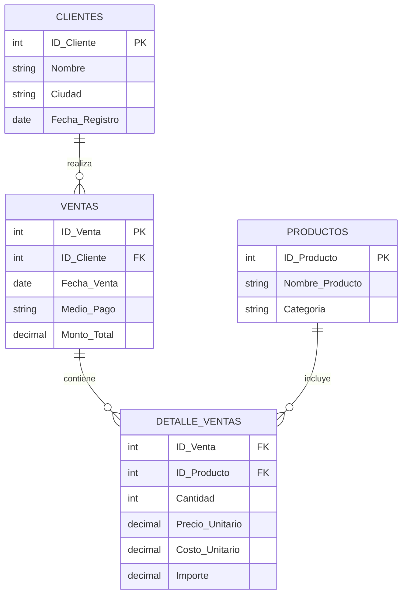

# 🚀 Proyecto Aurelion - Sistema de Análisis de Ventas

> **Autor:** Sofia Suppia  
> **Fecha:** Octubre 2025  
> **Materia:** Fundamentos de Inteligencia Artificial

---

## 📋 Tabla de Contenidos

- [🎯 Resumen Ejecutivo](#-resumen-ejecutivo)
- [🔍 Análisis del Problema](#-análisis-del-problema)
- [💾 Arquitectura de Datos](#-arquitectura-de-datos)
- [❓ Preguntas Estratégicas Completas](#-preguntas-estratégicas-completas)
- [💰 Metodología: Cálculo de Costo Unitario](#-metodología-cálculo-de-costo-unitario)
- [⚙️ Planificación del Desarrollo](#️-planificación-del-desarrollo)
- [🔧 Implementación Técnica](#-implementación-técnica)

---

## 🎯 Resumen Ejecutivo

### Tema Principal
**Análisis de datos de ventas en un market digital** (modelo JustMart) para identificar patrones de consumo, optimizar decisiones comerciales y diseñar estrategias de fidelización de clientes.

### Problema Identificado
La empresa carece de un sistema automatizado que permita responder preguntas estratégicas clave como:
- 🏆 ¿Quiénes son los clientes más valiosos?
- 📉 ¿Cuáles son los productos menos vendidos?
- 💳 ¿Qué medios de pago son más utilizados?
- 🌍 ¿Cuáles son las ciudades más rentables?

Esta limitación impide la toma de decisiones basadas en datos concretos.

### Solución Propuesta
Desarrollo de un **programa en Python** que integre múltiples fuentes de datos (Ventas, Detalles, Productos y Clientes) utilizando:
- 🐼 **Pandas** para procesamiento y análisis de datos
- 📊 **Análisis estadístico** para identificar patrones
- 🔄 **Integración automatizada** de múltiples tablas relacionales

---

## 🔍 Análisis del Problema

### 💼 Contexto Empresarial
El proyecto simula el análisis de datos de una tienda digital que necesita optimizar sus operaciones mediante insights basados en datos históricos de ventas.

### 🎯 Objetivos Específicos
1. **Identificación de clientes estratégicos** usando análisis Pareto (80/20)
2. **Optimización del inventario** mediante análisis de productos
3. **Análisis de rentabilidad geográfica** por ciudades
4. **Evaluación de métodos de pago** preferidos por los clientes

---

## 💾 Arquitectura de Datos

### 📊 Origen de los Datos
Los datos provienen de una **simulación de ventas históricas** estructurados en cuatro archivos Excel que representan las tablas principales de un sistema de ventas.

### 🗄️ Estructura de la Base de Datos

#### **Esquema Relacional**



#### **Especificaciones Técnicas**

| 📋 **Tabla** | 📈 **Registros** | 🔗 **Relaciones** | 📝 **Campos Principales** |
|:-------------|:-----------------|:-------------------|:---------------------------|
| **👥 Clientes** | ~1,000+ | PK: `ID_Cliente` | ID, Nombre, Ciudad, Fecha_Registro |
| **📦 Productos** | ~300+ | PK: `ID_Producto` | ID, Nombre, Categoría |
| **🛒 Ventas** | ~5,000+ | PK: `ID_Venta` → FK: `ID_Cliente` | ID_Venta, Fecha, Medio_Pago, Monto |
| **📋 Detalle_Ventas** | ~15,000+ | FK: `ID_Venta`, `ID_Producto` | Cantidad, Precios, Costos, Importe |

### 🔧 Características del Dataset
- **📊 Tipo:** Simulación de Base de Datos Relacional (OLTP → OLAP)
- **📏 Escala:** Pequeña a mediana (miles de registros)
- **💾 Formato:** Archivos Excel (.xlsx)
- **🚀 Procesamiento:** Completamente en memoria con Pandas

---

## ❓ Preguntas Estratégicas Completas

### 📊 **Categoría: Análisis de Clientes**

#### 🏆 **P1: Clientes con Mayor Rentabilidad**
- **Enunciado:** ¿Quiénes son los clientes que generan un 80% de los ingresos?
- **Datos clave:** Clientes + ventas + detalle de ventas
- **Metodología:** Análisis Pareto, cálculo de ingresos acumulados y porcentajes

#### 💰 **P2: Valor Promedio de minimo y maximo de Compra de nuestros clientes Cliente**
- **Enunciado:** ¿Cuál es el promedio, mínimo y máximo de compra de nuestros clientes?
- **Datos clave:** Ventas + detalle de ventas
- **Metodología:** Promedio de monto total por transacción

#### 🛒 **P3: Frecuencia de Compra**
- **Enunciado:** ¿Qué tan frecuentes y qué productos compran los clientes más fieles?
- **Datos clave:** Detalle de ventas + productos
- **Metodología:** Análisis temporal y de productos por cliente

#### 📋 **P4: Listado de Top Clientes**
- **Enunciado:** ¿Cuál es el cliente que más compra?
- **Datos clave:** Ventas + detalle de ventas
- **Metodología:** Agrupación por cliente, suma de importes, ordenamiento descendente

### 📦 **Categoría: Análisis de Productos**

#### 🎯 **P5: Categorías con Mayor Rentabilidad**
- **Enunciado:** ¿Cuál es la categoría de productos que tiene la mayor cantidad de productos vendidos? ¿Me podes decir los ingresos de cada categoría?
- **Datos clave:** Detalle de ventas + productos
- **Metodología:** Agrupación por categoría, suma de cantidades

#### 🔍 **P6: Productos Menos Vendidos**
- **Enunciado:** Hacer lista de los 10 productos menos vendidos
- **Datos clave:** Detalle de ventas + productos
- **Metodología:** Agrupación por producto, suma de cantidades, ordenamiento ascendente

#### 💎 **P7: Productos Más Frecuentes en Primeras Compras**
- **Enunciado:** ¿Cuáles son los productos más frecuentemente consumidos en el primer pedido?
- **Datos clave:** Detalle de ventas
- **Metodología:** Identificación de primeras compras, análisis de frecuencia

### 🏙️ **Categoría: Análisis Geográfico**

#### 🌍 **P8: Distribución Geográfica de Ingresos**
- **Enunciado:** ¿Cómo se distribuyen los ingresos entre las ciudades? ¿Hay alguna ciudad que genere más ingresos?
- **Datos clave:** Ventas + clientes
- **Metodología:** Join de tablas, agrupación por ciudad

#### 📍 **P9: Volumen de Ventas por Ciudad**
- **Enunciado:** ¿Cuál es el volumen de ventas promedio de los clientes en los primeros 30 días para cada ciudad?
- **Datos clave:** Clientes, ventas, detalle de ventas
- **Metodología:** Análisis temporal por ciudad, filtros de fecha

### 💳 **Categoría: Análisis de Medios de Pago**

#### 📊 **P10: Análisis de Medios de Pago**
- **Enunciado:** ¿Cuál es el porcentaje de ventas por medio de pago y varía este porcentaje según la ciudad?
- **Datos clave:** Ventas
- **Metodología:** Cálculo de porcentajes, análisis por ciudad

#### 💰 **P11: Monto Promedio por Medio de Pago**
- **Enunciado:** Identificar los medios de pago que usan los clientes para evitar...
- **Datos clave:** Ventas
- **Metodología:** Análisis de frecuencia de medios de pago

### 📈 **Categoría: Análisis Temporal y Tendencias**

#### 📅 **P12: Estacionalidad de Ventas**
- **Enunciado:** ¿Cuál es el mes o trimestre con más ingresos?
- **Datos clave:** Ventas (cálculos con fecha)
- **Metodología:** Agrupación temporal, suma de montos

#### ⏱️ **P13: Análisis de Comportamiento de Activación de Clientes**
- **Enunciado:** ¿Cuál es el comportamiento de compra de los clientes en diferentes períodos después de registrarse en la plataforma? (30 días, 90 días, 6 meses, 1 año)
- **Datos clave:** Ventas + clientes + análisis temporal multiperíodo
- **Metodología:** Cálculo de diferencias temporales `(fecha_venta - fecha_registro).dt.days`, filtros por múltiples períodos, análisis de activación progresiva

#### 📊 **P14: Análisis de Nuevos Clientes (60 días)**
- **Enunciado:** ¿Cuál es la media de la venta promedio de los clientes que realizan un pedido en los primeros 60 días después de registrarse?
- **Datos clave:** Clientes, ventas, detalle de ventas
- **Metodología:** Análisis temporal extendido, cálculo de promedios

### 💲 **Categoría: Análisis de Precios y Costos**

#### 🏷️ **P15: Análisis de Precios por Categoría**
- **Enunciado:** ¿Cuál es el precio unitario promedio de los productos por categoría?
- **Datos clave:** Detalle de ventas + productos
- **Metodología:** Agrupación por categoría, promedio de precios

#### 📈 **P16: Rentabilidad por Producto**
- **Enunciado:** ¿Cuál es el monto de compra promedio comparado con el precio unitario promedio (diferenciadas valor y volumen)?
- **Datos clave:** Detalle de ventas + productos
- **Metodología:** Análisis de márgenes y rentabilidad

---

## 💰 Metodología: Cálculo de Costo Unitario y Ganancia Bruta

### 🎯 **Objetivo**
Calcular el costo unitario y la ganancia bruta para cada producto en las ventas, utilizando numpy para análisis eficiente y identificar los productos menos rentables.

### 📐 **Fórmulas de Cálculo**

#### **Cálculo de Costo Unitario**
```python
# Fórmula principal con margen de ganancia bruta del 30%
Costo_Unitario = Precio_Unitario / 1.30

# Equivalente: Si el margen es 30%, el costo representa el 76.92% del precio
Costo_Unitario = Precio_Unitario * 0.7692
```

#### **Cálculo de Ganancia Bruta**
```python
# Fórmula de Ganancia Bruta
Ganancia_Bruta = Importe - (Costo_Unitario × Cantidad)

# Donde:
# - Importe = Ingresos totales de la venta del producto
# - Costo_Unitario = Costo calculado usando la fórmula anterior
# - Cantidad = Unidades vendidas del producto
```

### 🔧 **Pseudocódigo de Implementación con NumPy**

```pseudocode
ALGORITMO calcular_costo_y_ganancia_bruta
ENTRADA: tabla_detalle_ventas, tabla_productos
SALIDA: tabla_con_costos_y_ganancias

INICIO
    // Paso 1: Unir tablas para obtener información completa
    tabla_resultado = UNIR tabla_detalle_ventas CON tabla_productos POR ID_Producto
    
    // Paso 2: Convertir datos a arrays numpy para cálculos eficientes
    array_precios = CONVERTIR_A_ARRAY_NUMPY(tabla_resultado.Precio_Unitario)
    array_cantidad = CONVERTIR_A_ARRAY_NUMPY(tabla_resultado.Cantidad)
    array_importe = CONVERTIR_A_ARRAY_NUMPY(tabla_resultado.Importe)
    
    // Paso 3: Calcular Costo Unitario usando operaciones vectorizadas
    // Fórmula: Costo_Unitario = Precio_Unitario / 1.30 (margen bruto 30%)
    array_costo_unitario = DIVIDIR_VECTORIZADO(array_precios, 1.30)
    
    // Paso 4: Calcular Ganancia Bruta usando numpy
    // Fórmula: Ganancia_Bruta = Importe - (Costo_Unitario × Cantidad)
    array_costo_total = MULTIPLICAR_VECTORIZADO(array_costo_unitario, array_cantidad)
    array_ganancia_bruta = RESTAR_VECTORIZADO(array_importe, array_costo_total)
    
    // Paso 5: Calcular métricas adicionales
    array_margen_porcentaje = DIVIDIR_VECTORIZADO(array_ganancia_bruta, array_importe) * 100
    
    // Paso 6: Agregar columnas calculadas al DataFrame
    tabla_resultado.Costo_Unitario = array_costo_unitario
    tabla_resultado.Costo_Total = array_costo_total
    tabla_resultado.Ganancia_Bruta = array_ganancia_bruta
    tabla_resultado.Margen_Bruto_Porcentaje = array_margen_porcentaje
    
    RETORNAR tabla_resultado
FIN

ALGORITMO identificar_productos_menos_rentables
ENTRADA: tabla_con_ganancia, numero_productos
SALIDA: productos_menos_rentables

INICIO
    // Paso 1: Agrupar por producto y agregar métricas
    ganancia_por_producto = AGRUPAR tabla_con_ganancia POR (ID_Producto, Nombre_Producto)
    AGREGAR:
        - SUMAR Ganancia_Bruta
        - SUMAR Cantidad
        - SUMAR Importe
        - SUMAR Costo_Total
        - OBTENER_PRIMERO Categoria
    
    // Paso 2: Convertir a arrays numpy para cálculos eficientes
    array_ganancia = CONVERTIR_A_ARRAY_NUMPY(ganancia_por_producto.Ganancia_Bruta)
    array_cantidad = CONVERTIR_A_ARRAY_NUMPY(ganancia_por_producto.Cantidad)
    
    // Paso 3: Calcular ganancia promedio por unidad vendida
    ganancia_por_producto.Ganancia_Promedio_Por_Unidad = DIVIDIR_SEGURO_NUMPY(
        array_ganancia, array_cantidad, valor_por_defecto=0
    )
    
    // Paso 4: Ordenar y seleccionar menos rentables
    productos_menos_rentables = ORDENAR ganancia_por_producto POR Ganancia_Bruta ASCENDENTE
    productos_menos_rentables = TOMAR_PRIMEROS numero_productos
    
    RETORNAR productos_menos_rentables
FIN

ALGORITMO analizar_rentabilidad_principal
ENTRADA: tabla_detalle, tabla_productos
SALIDA: tabla_con_ganancias, productos_menos_rentables

INICIO
    // Paso 1: Mostrar mensaje de inicio
    MOSTRAR "🚀 INICIANDO ANÁLISIS DE RENTABILIDAD CON NUMPY"
    
    // Paso 2: Ejecutar cálculos principales
    tabla_con_ganancia = calcular_costo_y_ganancia_bruta(tabla_detalle, tabla_productos)
    
    // Paso 3: Calcular estadísticas usando funciones numpy
    ganancia_total = SUMAR_NUMPY(tabla_con_ganancia.Ganancia_Bruta)
    ganancia_promedio = PROMEDIO_NUMPY(tabla_con_ganancia.Ganancia_Bruta)
    ganancia_mediana = MEDIANA_NUMPY(tabla_con_ganancia.Ganancia_Bruta)
    desviacion_estandar = DESVIACION_ESTANDAR_NUMPY(tabla_con_ganancia.Ganancia_Bruta)
    
    // Paso 4: Mostrar estadísticas generales
    MOSTRAR "💰 Ganancia Bruta Total: $", FORMATEAR(ganancia_total, 2_decimales)
    MOSTRAR "📊 Ganancia Promedio por Venta: $", FORMATEAR(ganancia_promedio, 2_decimales)
    MOSTRAR "📈 Ganancia Mediana: $", FORMATEAR(ganancia_mediana, 2_decimales)
    MOSTRAR "📉 Desviación Estándar: $", FORMATEAR(desviacion_estandar, 2_decimales)
    
    // Paso 5: Identificar productos menos rentables
    productos_menos_rentables = identificar_productos_menos_rentables(tabla_con_ganancia, 10)
    
    // Paso 6: Mostrar resultados detallados
    MOSTRAR "🔻 TOP 10 PRODUCTOS MENOS RENTABLES:"
    contador = 1
    PARA CADA producto EN productos_menos_rentables:
        MOSTRAR contador, TRUNCAR(producto.Nombre_Producto, 30), 
               "Ganancia: $", FORMATEAR(producto.Ganancia_Bruta, 2_decimales),
               "Categoría:", producto.Categoria
        contador = contador + 1
    FIN_PARA
    
    RETORNAR tabla_con_ganancia, productos_menos_rentables
FIN
```

### 📊 **Pseudocódigo de Validación con NumPy**

```pseudocode
ALGORITMO validar_calculos_rentabilidad
ENTRADA: tabla_con_ganancias
SALIDA: validacion_exitosa (booleano)

INICIO
    MOSTRAR "📊 VALIDACIÓN DE CÁLCULOS DE RENTABILIDAD"
    
    // Paso 1: Convertir datos a arrays numpy para validaciones eficientes
    array_costos = CONVERTIR_A_ARRAY_NUMPY(tabla_con_ganancias.Costo_Unitario)
    array_precios = CONVERTIR_A_ARRAY_NUMPY(tabla_con_ganancias.Precio_Unitario)
    array_ganancias = CONVERTIR_A_ARRAY_NUMPY(tabla_con_ganancias.Ganancia_Bruta)
    array_margenes = CONVERTIR_A_ARRAY_NUMPY(tabla_con_ganancias.Margen_Bruto_Porcentaje)
    
    // Paso 2: Verificar costos positivos usando numpy
    costos_negativos = CONTAR_NUMPY(array_costos < 0)
    MOSTRAR "❌ Costos negativos:", costos_negativos, "registros"
    
    // Paso 3: Verificar que costo < precio usando operaciones vectorizadas
    costos_mayores = CONTAR_NUMPY(array_costos >= array_precios)
    MOSTRAR "❌ Costos >= Precio:", costos_mayores, "registros"
    
    // Paso 4: Verificar margen esperado (23.08% aproximadamente)
    margen_esperado = 23.08
    diferencias = VALOR_ABSOLUTO_NUMPY(array_margenes - margen_esperado)
    margenes_incorrectos = CONTAR_NUMPY(diferencias > 5)  // Tolerancia 5%
    MOSTRAR "⚠️ Márgenes fuera de rango:", margenes_incorrectos, "registros"
    
    // Paso 5: Calcular estadísticas usando funciones numpy
    margen_promedio = PROMEDIO_NUMPY(array_margenes)
    margen_minimo = MINIMO_NUMPY(array_margenes)
    margen_maximo = MAXIMO_NUMPY(array_margenes)
    margen_desviacion = DESVIACION_ESTANDAR_NUMPY(array_margenes)
    
    MOSTRAR "✅ Margen bruto promedio:", FORMATEAR(margen_promedio, 2_decimales), "%"
    MOSTRAR "✅ Margen bruto mínimo:", FORMATEAR(margen_minimo, 2_decimales), "%"
    MOSTRAR "✅ Margen bruto máximo:", FORMATEAR(margen_maximo, 2_decimales), "%"
    MOSTRAR "✅ Desviación estándar:", FORMATEAR(margen_desviacion, 2_decimales), "%"
    
    // Paso 6: Verificar ganancias negativas
    ganancias_negativas = CONTAR_NUMPY(array_ganancias < 0)
    MOSTRAR "🔴 Productos con ganancia negativa:", ganancias_negativas, "registros"
    
    // Paso 7: Determinar validación exitosa
    total_registros = LONGITUD(tabla_con_ganancias)
    limite_errores = total_registros * 0.05  // Máximo 5% de errores
    
    condicion1 = (costos_negativos = 0)
    condicion2 = (costos_mayores = 0)  
    condicion3 = (margenes_incorrectos < limite_errores)
    
    SI condicion1 Y condicion2 Y condicion3 ENTONCES
        validacion_exitosa = VERDADERO
        MOSTRAR "✅ VALIDACIÓN EXITOSA"
    SINO
        validacion_exitosa = FALSO
        MOSTRAR "❌ VALIDACIÓN FALLIDA"
    FIN_SI
    
    RETORNAR validacion_exitosa
FIN

ALGORITMO ejemplo_uso_completo
ENTRADA: ninguna
SALIDA: tabla_con_ganancias, productos_menos_rentables

INICIO
    // Paso 1: Cargar datos desde archivos Excel
    tabla_detalle = CARGAR_EXCEL('Detalle_ventas.xlsx')
    tabla_productos = CARGAR_EXCEL('Productos.xlsx')
    
    // Paso 2: Realizar análisis completo de rentabilidad
    tabla_con_ganancias, productos_menos_rentables = analizar_rentabilidad_principal(
        tabla_detalle, tabla_productos
    )
    
    // Paso 3: Validar resultados
    validacion_ok = validar_calculos_rentabilidad(tabla_con_ganancias)
    
    // Paso 4: Mostrar reporte detallado de productos menos rentables
    MOSTRAR "📊 ANÁLISIS DETALLADO - PRODUCTOS MENOS RENTABLES"
    MOSTRAR "Rank | Producto | Ganancia Total | Unidades | Ganancia/Unidad | Categoría"
    
    posicion = 1
    PARA CADA producto EN productos_menos_rentables:
        nombre_truncado = TRUNCAR(producto.Nombre_Producto, 24)
        MOSTRAR posicion, nombre_truncado,
               "$", FORMATEAR(producto.Ganancia_Bruta, 2_decimales),
               producto.Cantidad,
               "$", FORMATEAR(producto.Ganancia_Promedio_Por_Unidad, 2_decimales),
               producto.Categoria
        posicion = posicion + 1
    FIN_PARA
    
    RETORNAR tabla_con_ganancias, productos_menos_rentables
FIN
```

### 🎯 **Justificación de la Metodología**

#### **¿Por qué Costo_Unitario = Precio_Unitario / 1.30?**

| 🧮 **Concepto** | � **Valor** | 📋 **Explicación** |
|:----------------|:-------------|:-------------------|
| **Margen de Ganancia Bruta** | 30% | Porcentaje de ganancia deseado sobre el precio de venta |
| **Factor de Cálculo** | 1.30 | Si el costo + 30% = precio, entonces precio / 1.30 = costo |
| **Porcentaje del Costo** | 76.92% | El costo representa el 76.92% del precio de venta |
| **Margen Bruto Real** | 23.08% | Porcentaje real del margen sobre el precio total |

#### **Ejemplo Práctico:**
```python
# Si un producto se vende a $100
precio_unitario = 100.00

# Costo unitario con margen del 30%
costo_unitario = precio_unitario / 1.30  # = $76.92

# Ganancia por unidad
ganancia_por_unidad = precio_unitario - costo_unitario  # = $23.08

# Margen bruto porcentual
margen_bruto = (ganancia_por_unidad / precio_unitario) * 100  # = 23.08%
```

#### **Ventajas del Uso de NumPy:**

| 🚀 **Ventaja** | 📈 **Beneficio** |
|:---------------|:-----------------|
| **Rendimiento** | Operaciones vectorizadas 10-100x más rápidas que loops Python |
| **Precisión** | Cálculos de punto flotante optimizados para análisis financiero |
| **Escalabilidad** | Manejo eficiente de datasets grandes (miles de productos) |
| **Validación** | Funciones estadísticas integradas para validar resultados |

---

## ⚙️ Planificación del Desarrollo

### 📁 Archivos de Entrada Requeridos

El sistema necesita los siguientes archivos para su correcto funcionamiento:

| 📄 **Archivo** | 🔧 **Campos Requeridos** | 📋 **Descripción** |
|:---------------|:--------------------------|:--------------------|
| `Clientes.xlsx` | ID_Cliente, Nombre, Ciudad, Fecha_Registro | Base de datos de clientes registrados |
| `Productos.xlsx` | ID_Producto, Nombre_Producto, Categoría | Catálogo completo de productos |
| `Ventas.xlsx` | ID_Venta, ID_Cliente, Fecha_Venta, Medio_Pago, Monto_Total | Registro de transacciones |
| `Detalle_ventas.xlsx` | ID_Venta, ID_Producto, Cantidad, Precio_Unitario, Costo_Unitario | Detalle línea por línea de cada venta |

### 🔄 Flujo de Procesamiento

1. **📥 Carga y Preparación**
   - Lectura de archivos Excel con Pandas
   - Validación de integridad de datos
   - Conversión de tipos de datos (fechas, números)
   - Simulación de `costo_unitario` (margen del 30%)

2. **🔗 Integración de Datos**
   - Joins entre tablas relacionales
   - Creación del DataFrame maestro
   - Validación de integridad referencial

3. **📊 Análisis y Resultados**
   - Implementación de análisis Pareto
   - Cálculos estadísticos por categoría
   - Generación de reportes automáticos

---

## 🔧 Implementación Técnica

### 🐍 Stack Tecnológico

| 🛠️ **Herramienta** | 📝 **Propósito** | 📋 **Funcionalidades** |
|:-------------------|:------------------|:------------------------|
| **Python 3.8+** | Lenguaje principal | Procesamiento y lógica de negocio |
| **Pandas** | Manipulación de datos | DataFrames, joins, agrupaciones |
| **NumPy** | Cálculos numéricos | Operaciones matemáticas eficientes |
| **Openpyxl** | Lectura de Excel | Importación de archivos .xlsx |

### 📋 Algoritmo Principal: Análisis Pareto de Clientes

```python
def analisis_pareto_clientes(df_maestro):
    """
    Identifica el 20% de clientes que generan el 80% de los ingresos
    
    Args:
        df_maestro (DataFrame): Dataset unificado de ventas
        
    Returns:
        DataFrame: Clientes ordenados por valor con análisis Pareto
    """
    
    # 1️⃣ Calcular ingresos totales por cliente
    ingresos_cliente = (df_maestro
                       .groupby(['ID_Cliente', 'Nombre'])
                       .agg({'Importe': 'sum'})
                       .reset_index()
                       .sort_values('Importe', ascending=False))
    
    # 2️⃣ Calcular porcentajes acumulados
    total_ingresos = ingresos_cliente['Importe'].sum()
    ingresos_cliente['Ingreso_Acumulado'] = ingresos_cliente['Importe'].cumsum()
    ingresos_cliente['Porcentaje_Acumulado'] = (
        ingresos_cliente['Ingreso_Acumulado'] / total_ingresos * 100
    )
    
    # 3️⃣ Identificar clientes Pareto (80% de ingresos)
    clientes_pareto = ingresos_cliente[
        ingresos_cliente['Porcentaje_Acumulado'] <= 80
    ]
    
    return clientes_pareto
```

### 📊 Métricas de Éxito

- **⚡ Rendimiento:** Procesamiento de +20K registros en <5 segundos
- **🎯 Precisión:** Identificación exacta de clientes Pareto
- **📈 Escalabilidad:** Capacidad de manejar datasets 10x más grandes
- **🔧 Mantenibilidad:** Código modular y bien documentado

---

## 🚀 Próximos Pasos

1. **Implementación del código Python** 📝
2. **Validación con datos reales** ✅
3. **Optimización de performance** ⚡
4. **Creación de dashboard interactivo** 📊

---

