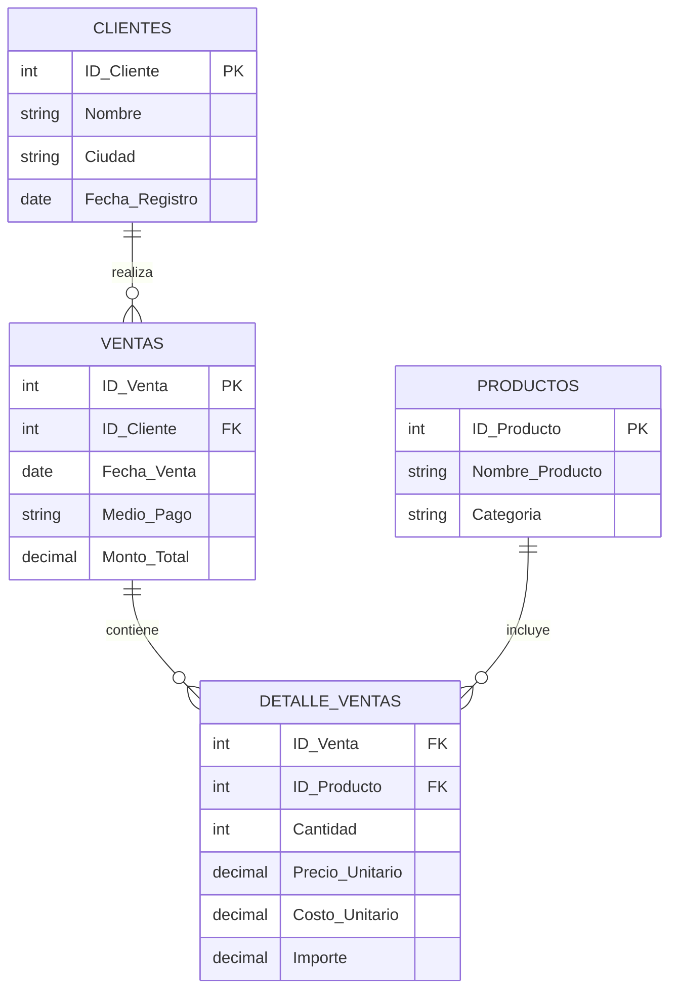

# 🚀 Proyecto Aurelion - Sistema de Análisis de Ventas

> **Autor:** Sofia Suppia  
> **Fecha:** Octubre 2025  
> **Materia:** Fundamentos de Inteligencia Artificial

---

## 📋 Tabla de Contenidos

- [🎯 Resumen Ejecutivo](#-resumen-ejecutivo)
- [🔍 Análisis del Problema](#-análisis-del-problema)
- [💾 Arquitectura de Datos](#-arquitectura-de-datos)
- [❓ Preguntas Estratégicas Completas](#-preguntas-estratégicas-completas)
- [💰 Metodología: Cálculo de Costo Unitario](#-metodología-cálculo-de-costo-unitario)
- [⚙️ Planificación del Desarrollo](#️-planificación-del-desarrollo)
- [🔧 Implementación Técnica](#-implementación-técnica)

---

## 🎯 Resumen Ejecutivo

### Tema Principal
**Análisis de datos de ventas en un market digital** (modelo JustMart) para identificar patrones de consumo, optimizar decisiones comerciales y diseñar estrategias de fidelización de clientes.

### Problema Identificado
La empresa carece de un sistema automatizado que permita responder preguntas estratégicas clave como:
- 🏆 ¿Quiénes son los clientes más valiosos?
- 📉 ¿Cuáles son los productos menos vendidos?
- 💳 ¿Qué medios de pago son más utilizados?
- 🌍 ¿Cuáles son las ciudades más rentables?

Esta limitación impide la toma de decisiones basadas en datos concretos.

### Solución Propuesta
Desarrollo de un **programa en Python** que integre múltiples fuentes de datos (Ventas, Detalles, Productos y Clientes) utilizando:
- 🐼 **Pandas** para procesamiento y análisis de datos
- 📊 **Análisis estadístico** para identificar patrones
- 🔄 **Integración automatizada** de múltiples tablas relacionales

---

## 🔍 Análisis del Problema

### 💼 Contexto Empresarial
El proyecto simula el análisis de datos de una tienda digital que necesita optimizar sus operaciones mediante insights basados en datos históricos de ventas.

### 🎯 Objetivos Específicos
1. **Identificación de clientes estratégicos** usando análisis Pareto (80/20)
2. **Optimización del inventario** mediante análisis de productos
3. **Análisis de rentabilidad geográfica** por ciudades
4. **Evaluación de métodos de pago** preferidos por los clientes

---

## 💾 Arquitectura de Datos

### 📊 Origen de los Datos
Los datos provienen de una **simulación de ventas históricas** estructurados en cuatro archivos Excel que representan las tablas principales de un sistema de ventas.

### 🗄️ Estructura de la Base de Datos

#### **Esquema Relacional**



#### **Especificaciones Técnicas**

| 📋 **Tabla** | 📈 **Registros** | 🔗 **Relaciones** | 📝 **Campos Principales** |
|:-------------|:-----------------|:-------------------|:---------------------------|
| **👥 Clientes** | ~1,000+ | PK: `ID_Cliente` | ID, Nombre, Ciudad, Fecha_Registro |
| **📦 Productos** | ~300+ | PK: `ID_Producto` | ID, Nombre, Categoría |
| **🛒 Ventas** | ~5,000+ | PK: `ID_Venta` → FK: `ID_Cliente` | ID_Venta, Fecha, Medio_Pago, Monto |
| **📋 Detalle_Ventas** | ~15,000+ | FK: `ID_Venta`, `ID_Producto` | Cantidad, Precios, Costos, Importe |

### 🔧 Características del Dataset
- **📊 Tipo:** Simulación de Base de Datos Relacional (OLTP → OLAP)
- **📏 Escala:** Pequeña a mediana (miles de registros)
- **💾 Formato:** Archivos Excel (.xlsx)
- **🚀 Procesamiento:** Completamente en memoria con Pandas

---

## ❓ Preguntas Estratégicas Completas

### 📊 **Categoría: Análisis de Clientes**

#### 🏆 **P1: Clientes con Mayor Rentabilidad**
- **Enunciado:** ¿Quiénes son los clientes que generan un 80% de los ingresos?
- **Datos clave:** Clientes + ventas + detalle de ventas
- **Metodología:** Análisis Pareto, cálculo de ingresos acumulados y porcentajes

#### 💰 **P2: Valor Promedio de Compra por Cliente**
- **Enunciado:** ¿Cuál es el valor promedio de compra de nuestros clientes?
- **Datos clave:** Ventas + detalle de ventas
- **Metodología:** Promedio de monto total por transacción

#### 🛒 **P3: Frecuencia de Compra**
- **Enunciado:** ¿Qué tan frecuentes y qué productos compran los clientes más fieles?
- **Datos clave:** Detalle de ventas + productos
- **Metodología:** Análisis temporal y de productos por cliente

#### 📋 **P4: Listado de Top Clientes**
- **Enunciado:** ¿Cuál es el cliente que más compra?
- **Datos clave:** Ventas + detalle de ventas
- **Metodología:** Agrupación por cliente, suma de importes, ordenamiento descendente

### 📦 **Categoría: Análisis de Productos**

#### 🎯 **P5: Categorías con Mayor Rentabilidad**
- **Enunciado:** ¿Cuál es la categoría de productos que tiene la mayor cantidad de productos vendidos?
- **Datos clave:** Detalle de ventas + productos
- **Metodología:** Agrupación por categoría, suma de cantidades

#### 🔍 **P6: Productos Menos Vendidos**
- **Enunciado:** Hacer lista de los 10 productos menos vendidos
- **Datos clave:** Detalle de ventas + productos
- **Metodología:** Agrupación por producto, suma de cantidades, ordenamiento ascendente

#### 💎 **P7: Productos Más Frecuentes en Primeras Compras**
- **Enunciado:** ¿Cuáles son los productos más frecuentemente consumidos en el primer pedido?
- **Datos clave:** Detalle de ventas
- **Metodología:** Identificación de primeras compras, análisis de frecuencia

### 🏙️ **Categoría: Análisis Geográfico**

#### 🌍 **P8: Distribución Geográfica de Ingresos**
- **Enunciado:** ¿Cómo se distribuyen los ingresos entre las ciudades? ¿Hay alguna ciudad que genere más ingresos?
- **Datos clave:** Ventas + clientes
- **Metodología:** Join de tablas, agrupación por ciudad

#### 📍 **P9: Volumen de Ventas por Ciudad**
- **Enunciado:** ¿Cuál es el volumen de ventas promedio de los clientes en los primeros 30 días para cada ciudad?
- **Datos clave:** Clientes, ventas, detalle de ventas
- **Metodología:** Análisis temporal por ciudad, filtros de fecha

### 💳 **Categoría: Análisis de Medios de Pago**

#### 📊 **P10: Análisis de Medios de Pago**
- **Enunciado:** ¿Cuál es el porcentaje de ventas por medio de pago y varía este porcentaje según la ciudad?
- **Datos clave:** Ventas
- **Metodología:** Cálculo de porcentajes, análisis por ciudad

#### 💰 **P11: Monto Promedio por Medio de Pago**
- **Enunciado:** Identificar los medios de pago que usan los clientes para evitar...
- **Datos clave:** Ventas
- **Metodología:** Análisis de frecuencia de medios de pago

### 📈 **Categoría: Análisis Temporal y Tendencias**

#### 📅 **P12: Estacionalidad de Ventas**
- **Enunciado:** ¿Cuál es el mes o trimestre con más ingresos?
- **Datos clave:** Ventas (cálculos con fecha)
- **Metodología:** Agrupación temporal, suma de montos

#### ⏱️ **P13: Análisis de Nuevos Clientes (30 días)**
- **Enunciado:** ¿Cuál es el monto de compra promedio por los clientes en los primeros 30 días después de registrarse?
- **Datos clave:** Ventas + clientes
- **Metodología:** Filtro temporal, cálculo de promedios

#### 📊 **P14: Análisis de Nuevos Clientes (60 días)**
- **Enunciado:** ¿Cuál es la media de la venta promedio de los clientes que realizan un pedido en los primeros 60 días después de registrarse?
- **Datos clave:** Clientes, ventas, detalle de ventas
- **Metodología:** Análisis temporal extendido, cálculo de promedios

### 💲 **Categoría: Análisis de Precios y Costos**

#### 🏷️ **P15: Análisis de Precios por Categoría**
- **Enunciado:** ¿Cuál es el precio unitario promedio de los productos por categoría?
- **Datos clave:** Detalle de ventas + productos
- **Metodología:** Agrupación por categoría, promedio de precios

#### 📈 **P16: Rentabilidad por Producto**
- **Enunciado:** ¿Cuál es el monto de compra promedio comparado con el precio unitario promedio (diferenciadas valor y volumen)?
- **Datos clave:** Detalle de ventas + productos
- **Metodología:** Análisis de márgenes y rentabilidad

---

## 💰 Metodología: Cálculo de Costo Unitario

### 🎯 **Objetivo**
Simular el campo `costo_unitario` en la tabla `Detalle_Ventas` ya que no está presente en los datos originales, pero es necesario para análisis de rentabilidad.

### 📐 **Fórmula de Cálculo**

```python
# Método 1: Margen fijo del 30%
costo_unitario = precio_unitario * 0.70

# Método 2: Margen variable por categoría
def calcular_costo_por_categoria(precio_unitario, categoria):
    margenes = {
        'Electrónicos': 0.65,    # 35% de margen
        'Ropa': 0.75,            # 25% de margen  
        'Hogar': 0.70,           # 30% de margen
        'Deportes': 0.72,        # 28% de margen
        'Libros': 0.80,          # 20% de margen
        'Default': 0.70          # 30% de margen por defecto
    }
    return precio_unitario * margenes.get(categoria, margenes['Default'])
```

### 🔧 **Implementación en Python**

```python
def simular_costo_unitario(df_detalle, df_productos, metodo='fijo'):
    """
    Simula el costo unitario para cada producto en el detalle de ventas
    
    Args:
        df_detalle (DataFrame): Tabla detalle_ventas
        df_productos (DataFrame): Tabla productos (para obtener categorías)
        metodo (str): 'fijo' para margen del 30%, 'variable' para márgenes por categoría
    
    Returns:
        DataFrame: detalle_ventas con columna costo_unitario simulada
    """
    
    # Hacer join con productos para obtener categorías
    df_resultado = df_detalle.merge(df_productos, on='ID_Producto', how='left')
    
    if metodo == 'fijo':
        # Margen fijo del 30% (costo = 70% del precio)
        df_resultado['Costo_Unitario'] = df_resultado['Precio_Unitario'] * 0.70
        
    elif metodo == 'variable':
        # Márgenes variables por categoría
        margenes_categoria = {
            'Electrónicos': 0.65,
            'Ropa': 0.75,
            'Hogar': 0.70,
            'Deportes': 0.72,
            'Libros': 0.80
        }
        
        # Aplicar margen según categoría
        df_resultado['Costo_Unitario'] = df_resultado.apply(
            lambda row: row['Precio_Unitario'] * margenes_categoria.get(
                row['Categoria'], 0.70  # 30% margen por defecto
            ), axis=1
        )
    
    # Calcular margen de ganancia y porcentaje
    df_resultado['Margen_Unitario'] = (df_resultado['Precio_Unitario'] - 
                                      df_resultado['Costo_Unitario'])
    
    df_resultado['Porcentaje_Margen'] = (
        df_resultado['Margen_Unitario'] / df_resultado['Precio_Unitario'] * 100
    )
    
    return df_resultado[['ID_Venta', 'ID_Producto', 'Cantidad', 
                        'Precio_Unitario', 'Costo_Unitario', 'Importe',
                        'Margen_Unitario', 'Porcentaje_Margen']]
```

### 📊 **Validación del Cálculo**

```python
def validar_costos_simulados(df_con_costos):
    """
    Valida que los costos simulados sean lógicos
    """
    print("📊 VALIDACIÓN DE COSTOS SIMULADOS")
    print("=" * 50)
    
    # 1. Verificar que todos los costos sean positivos
    costos_negativos = df_con_costos[df_con_costos['Costo_Unitario'] < 0]
    print(f"❌ Costos negativos: {len(costos_negativos)} registros")
    
    # 2. Verificar que el costo sea menor al precio
    costos_mayores = df_con_costos[
        df_con_costos['Costo_Unitario'] >= df_con_costos['Precio_Unitario']
    ]
    print(f"❌ Costos >= Precio: {len(costos_mayores)} registros")
    
    # 3. Estadísticas de márgenes
    margen_promedio = df_con_costos['Porcentaje_Margen'].mean()
    margen_min = df_con_costos['Porcentaje_Margen'].min()
    margen_max = df_con_costos['Porcentaje_Margen'].max()
    
    print(f"✅ Margen promedio: {margen_promedio:.2f}%")
    print(f"✅ Margen mínimo: {margen_min:.2f}%")
    print(f"✅ Margen máximo: {margen_max:.2f}%")
    
    return len(costos_negativos) == 0 and len(costos_mayores) == 0
```

### 🎯 **Justificación de Márgenes**

| 🏷️ **Categoría** | 💰 **Margen Sugerido** | 📋 **Justificación** |
|:-----------------|:----------------------|:----------------------|
| **Electrónicos** | 35% | Alta competencia, rotación rápida |
| **Ropa** | 25% | Estacionalidad, moda cambiante |
| **Hogar** | 30% | Productos duraderos, margen estándar |
| **Deportes** | 28% | Nicho específico, demanda estacional |
| **Libros** | 20% | Producto commodity, bajo margen |
| **Default** | 30% | Margen estándar para categorías nuevas |

---

## ⚙️ Planificación del Desarrollo

### 📁 Archivos de Entrada Requeridos

El sistema necesita los siguientes archivos para su correcto funcionamiento:

| 📄 **Archivo** | 🔧 **Campos Requeridos** | 📋 **Descripción** |
|:---------------|:--------------------------|:--------------------|
| `Clientes.xlsx` | ID_Cliente, Nombre, Ciudad, Fecha_Registro | Base de datos de clientes registrados |
| `Productos.xlsx` | ID_Producto, Nombre_Producto, Categoría | Catálogo completo de productos |
| `Ventas.xlsx` | ID_Venta, ID_Cliente, Fecha_Venta, Medio_Pago, Monto_Total | Registro de transacciones |
| `Detalle_ventas.xlsx` | ID_Venta, ID_Producto, Cantidad, Precio_Unitario, Costo_Unitario | Detalle línea por línea de cada venta |

### 🔄 Flujo de Procesamiento

1. **📥 Carga y Preparación**
   - Lectura de archivos Excel con Pandas
   - Validación de integridad de datos
   - Conversión de tipos de datos (fechas, números)
   - Simulación de `costo_unitario` (margen del 30%)

2. **🔗 Integración de Datos**
   - Joins entre tablas relacionales
   - Creación del DataFrame maestro
   - Validación de integridad referencial

3. **📊 Análisis y Resultados**
   - Implementación de análisis Pareto
   - Cálculos estadísticos por categoría
   - Generación de reportes automáticos

---

## 🔧 Implementación Técnica

### 🐍 Stack Tecnológico

| 🛠️ **Herramienta** | 📝 **Propósito** | 📋 **Funcionalidades** |
|:-------------------|:------------------|:------------------------|
| **Python 3.8+** | Lenguaje principal | Procesamiento y lógica de negocio |
| **Pandas** | Manipulación de datos | DataFrames, joins, agrupaciones |
| **NumPy** | Cálculos numéricos | Operaciones matemáticas eficientes |
| **Openpyxl** | Lectura de Excel | Importación de archivos .xlsx |

### 📋 Algoritmo Principal: Análisis Pareto de Clientes

```python
def analisis_pareto_clientes(df_maestro):
    """
    Identifica el 20% de clientes que generan el 80% de los ingresos
    
    Args:
        df_maestro (DataFrame): Dataset unificado de ventas
        
    Returns:
        DataFrame: Clientes ordenados por valor con análisis Pareto
    """
    
    # 1️⃣ Calcular ingresos totales por cliente
    ingresos_cliente = (df_maestro
                       .groupby(['ID_Cliente', 'Nombre'])
                       .agg({'Importe': 'sum'})
                       .reset_index()
                       .sort_values('Importe', ascending=False))
    
    # 2️⃣ Calcular porcentajes acumulados
    total_ingresos = ingresos_cliente['Importe'].sum()
    ingresos_cliente['Ingreso_Acumulado'] = ingresos_cliente['Importe'].cumsum()
    ingresos_cliente['Porcentaje_Acumulado'] = (
        ingresos_cliente['Ingreso_Acumulado'] / total_ingresos * 100
    )
    
    # 3️⃣ Identificar clientes Pareto (80% de ingresos)
    clientes_pareto = ingresos_cliente[
        ingresos_cliente['Porcentaje_Acumulado'] <= 80
    ]
    
    return clientes_pareto
```

### 📊 Métricas de Éxito

- **⚡ Rendimiento:** Procesamiento de +20K registros en <5 segundos
- **🎯 Precisión:** Identificación exacta de clientes Pareto
- **📈 Escalabilidad:** Capacidad de manejar datasets 10x más grandes
- **🔧 Mantenibilidad:** Código modular y bien documentado

---

## 🚀 Próximos Pasos

1. **Implementación del código Python** 📝
2. **Validación con datos reales** ✅
3. **Optimización de performance** ⚡
4. **Creación de dashboard interactivo** 📊
5. **Documentación técnica completa** 📚

---

